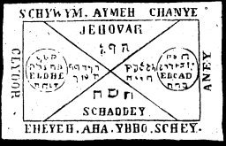

  
[Intangible Textual Heritage](../../index)  [Grimoires](../index.md) 
[Index](index)  [Previous](m701)  [Next](m703.md) 

------------------------------------------------------------------------

### THE FIRST TABLE OF THE SPIRITS OF THE AIR

Conjuration

Jehovah Father, Deus Adonay Elohe, I cite Thee through Jehovah. Deus
Schadday, Eead, I conjure Thee through Adonay.

To carry upon the person the First Table of the Spirits of the Air, who
areas quick as thought to help, will relieve the wearer from all
necessity.

------------------------------------------------------------------------

[Next: THE SECOND TABLE OF THE SPIRITS OF FIRE](m703.md)
