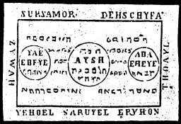

  
[Intangible Textual Heritage](../../index)  [Grimoires](../index) 
[Index](index)  [Previous](m702)  [Next](m704) 

------------------------------------------------------------------------

### THE SECOND TABLE OF THE SPIRITS OF FIRE

Conjuration

Aha, I conjure Thee (Tetragrammaton) Aha by Eheye, \* by Ihros, Eheye,
by Agla Aysch, Jehovah, conjure I Thee, that thou appear unto me.

------------------------------------------------------------------------

[Next: THE THIRD TABLE OF THE SPIRITS OF WATER](m704)
