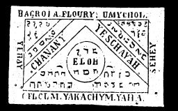

  
[Intangible Textual Heritage](../../index)  [Grimoires](../index.md) 
[Index](index)  [Previous](m703)  [Next](m705.md) 

------------------------------------------------------------------------

### THE THIRD TABLE OF THE SPIRITS OF WATER

Conjuration

I call upon and command thee Chananya by God Tetragrammaton Eloh. I
conjure Thee Yeschaijah by Alpha and Omega, and Thou art compelled
through Adonai.

The Third Table brings great fortune by water, and its spirits will
amply supply the treasures of the deep.

------------------------------------------------------------------------

[Next: THE FOURTH TABLE OF THE SPIRITS OF THE EARTH](m705.md)
