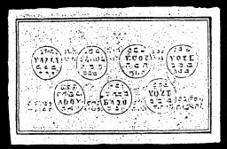

  
[Intangible Textual Heritage](../../index)  [Grimoires](../index.md) 
[Index](index)  [Previous](m705)  [Next](m707.md) 

------------------------------------------------------------------------

### THE FIFTH TABLE OF SATURN

Conjuration

I, N.N., order, command and conjure Thee Sazlij, by Agios, Sedul, by
Sother, Veduij, by Sabaot, Sove, Amonzion \* Adoij, by Helohim, Jaho, by
the Veritas Jehovah \* Kawa, Alha, natos that ye must appear before me
in human form, so truly as Daniel overcame and conquered Baal. Fiat,
Fiat, Fiat.

The Spirits of the Fifth Table of Saturn will serve in everything
according to wish. Their Table will bring good luck in play(games of
chance).

------------------------------------------------------------------------

[Next: THE SIXTH TABLE OF JUPITER](m707.md)
