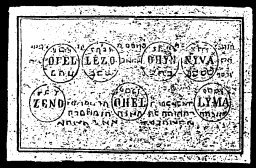

  
[Intangible Textual Heritage](../../index)  [Grimoires](../index) 
[Index](index)  [Previous](m706)  [Next](m708) 

------------------------------------------------------------------------

### THE SIXTH TABLE OF JUPITER

Conjuration

I conjure Thee, Spirit Ofel, by Alpha and Omega, Lezo and Yschirios \*
Ohin Ission \* Niva, by Tetragrammaton, Zeno, by Peraclitus \* Ohel, by
Orlenius, Lima, by Agla \*, that ye will obey and appear before me and
fulfil my desire, thus in and through the name Elion, which Moses named.
Fiat, fiat, fiat.

The Sixth Table of Jupiter assists in overcoming lawsuits, disputes, and
in winning at play or games of chance. Their spirits are at all times
ready to render assistance.

------------------------------------------------------------------------

[Next: THE SEVENTH TABLE OF MARS](m708)
