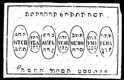

  
[Intangible Textual Heritage](../../index)  [Grimoires](../index.md) 
[Index](index)  [Previous](m708)  [Next](m710.md) 

------------------------------------------------------------------------

### THE EIGHTH TABLE OF THE SUN

Conjuration

I, N.N., conjure Thee, Wrjch by Dalia  Jka, by Doluth
\*, Auet, by Dilu \* Veal, by Anub  Meho, by Igfa \*
Ymij, by Eloij \* that Ye appear before my so true Zebaoth, who was
named by Moses, and all the rivers in Egypt were turned into blood.

The Eighth Table of the Spirits of the Sun will help attain honor and
wealth, and they also give gold and treasure.

------------------------------------------------------------------------

[Next: THE NINTH TABLE OF VENUS](m710.md)
