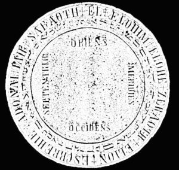

  
[Intangible Textual Heritage](../../index)  [Grimoires](../index) 
[Index](index)  [Previous](m7100)  [Next](m7102) 

------------------------------------------------------------------------

### Instructions

If you want to compel spirits to appear visibly before you and render
you obedience, observe the following instructions:

1\. Keep God's commandments as much as possible.

2\. Build and trust solely upon the might and power of God: believe
firmly in his omnipotent help in your work, and the spirits will become
your servants and will obey you.

3\. Continue your citations and do not cease, even if the spirits do not
appear at once. Be steadfast in your work and have faith, for the
doubter will obtain nothing.

4\. Take special note of the times for the invocation:

|                 |                                                         |
|-----------------|---------------------------------------------------------|
| Monday night    | from eleven until three.                                |
| Tuesday night   | from ten until two                                      |
| Wednesday night | from twelve until three                                 |
| Thursday night  | from twelve until two                                   |
| Friday night    | from ten until three                                    |
| Saturday night  | from ten until twelve                                   |
| Sunday Sabbath  | keep holy unto the Lord Sabaoth, Adonai, Tetragrammaton |

 

5\. The time must be the new moon, that is, the moon must be waxing.

6\. Trace the circle {below} on parchment with the blood of Young white
doves. The size of the circle is optional.

7\. The circle must be consecrated before the ceremony, with the
following words:

Ego (name of the conjuror), consecro et benedico istum circulum per
Nomina Dei Attisimi in ec Scripta, ut sit mihi et omnibus Scutum et
Protectio dei Fortissimi Elohim Invincibilie contra omnes malignos
Spiritus, gerurmque Potestates. In Nomine Dei Patris Dei Filii Dei
Spiritus Sancti. Amen.

Upon your entrance into this circle, speak as follows: Tetragrammaton,
Theos, Ischiros, Athanatos, Messias, Imas, Kyrie Eleison. Amen.

After you have entered the circle, begin your operation with the
following prayer from the Ninety-first psalm:

He that dwelleth in the secret place of the Most High shall abide under
the shadow of the Almighty. I will say of the Lord, He is my refuge and
my fortress, my God, in Him will I trust. Surely He shall deliver me
from the snare of the fowler and from the noisome pestilence. He shall
cover thee with His feathers and under his wings shalt thou trust. His
truth shall be thy shield and thy buckler. Thou shalt not be afraid of
the terror by night nor of the arrow that flieth by day. Because thou
hast made the Lord, which is my refuge, even the Most High, thy
habitation. There shall no evil befall thee, neither shall any plague
come nigh thy dwelling. Because he has set his love upon me, therefore
will I deliver him. I will set him on high because he has known my name.
He will call upon me and I will answer him. I will be with him in
trouble. I will deliver him and honor him. With long life will I satisfy
him and show him My salvation. Even so help me and all them that seek
thy holy God the Father  God the Son
 God the Holy Ghost , Amen.

CIRCLE WRITTEN ON PARCHMENT

WITH THE

BLOOD OF WHITE YOUNG DOVES.

------------------------------------------------------------------------

[Next: Citation of the Seven Great Princes](m7102)
