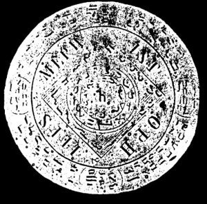

  
[Intangible Textual Heritage](../../index)  [Grimoires](../index.md) 
[Index](index)  [Previous](m7106)  [Next](m7108.md) 

------------------------------------------------------------------------

### Citation of Mephistophilis

  

## MEPHISTOPHILIS

Seal or Character for Coercion and Obedience

Messias, Adonaij, Weforus, Xathor, Yxewe, Soraweijs, Yxaron, Wegharh,
Zijhalor, Weghaij, Weosron, Xoxijwe, Zijwohwawetho, Ragthoswatho,
Zebaoth, Adonaij, Zijwetho, Aglaij, Wijzathe, Zadaij, Zijebo, Xosthoy,
Athlato, Zsewey, Zyxyset, Ysche, Sarsewu, Zyzyrn, Deworonhathbo, Xyxewe,
Syzwe, Theos, Yschaos, Worsonbefgosy, Gefgowe, Hegor, Quaratho, Zywe,
Messias, Abarabi, Mephistophilis.

------------------------------------------------------------------------

[Next: Citation of Barbuel](m7108.md)
