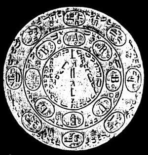

  
[Intangible Textual Heritage](../../index)  [Grimoires](../index) 
[Index](index)  [Previous](m7107)  [Next](m7109) 

------------------------------------------------------------------------

### Citation of Barbuel

  

## BARBUELIS

Seal or Character for Coercion and Obedience.

Yschiros, Imns, Zebaoth, Otheos, Kuwethosorym, Zylohym, Zaday, Yschowe,
Quyos, Zenhatorowav, Yzwesor, Xywoy, Yzyryr, Zalijmo, Zabaoth, Adonaii,
Messias, Aglabaij, Stoweos, Hijwetho, Ycoros, Zijwetho, Uwoim, Chamoweo,
Zijzobeth, Sotho, Emnohalj, Zedije, Huwethos, Chorij, Yzquoos, Liraije,
Weghoijm, Xiixor, Waijos, Gofaljme, Toroswe, Yeijros, Emanuel, Imas,
Barbuel.

------------------------------------------------------------------------

[Next: Citation of Aziabel](m7109)
