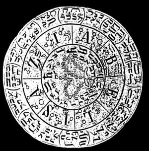

  
[Intangible Textual Heritage](../../index)  [Grimoires](../index) 
[Index](index)  [Previous](m7108)  [Next](m7110) 

------------------------------------------------------------------------

### Citation of Aziabel

  

## AZIABELIS

Seal or Character for Coercion and Obedience.

Thoeos, Ygweto, Yzgowoij, Quiseo, Wijzope, Xorsoij, Nowetho, Yxose,
Haguthou, Xoro, Theos, Magowo, Wijzosorwothe, Xaroshaij, Zebaoth,
Emanuel, Messias, Yzijwotho, Zadaij, Xexhatosijmeij, Buwatho, Ysewet,
Xijrathor, Zijbos, Malhaton, Yzos, Uzewor, Raguil, Wewot, Yzewewe,
Quorhijm, Zadob, Zibathor, Weget, Zijzawe, Ulijzor, Tetragrammaton,
Aziabel.

------------------------------------------------------------------------

[Next: Citation of Anituel](m7110)
