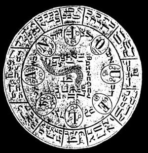

  
[Intangible Textual Heritage](../../index)  [Grimoires](../index.md) 
[Index](index)  [Previous](m7109)  [Next](m7111.md) 

------------------------------------------------------------------------

### Citation of Anituel

  

## ANTQUELIS

Seal or Character for Coercion and Obedience.

Thoeos, Aba, Aaba, Aba, Agathoswaij, Yzoroij, Ywetho, Quardos, Quasoai,
Uschjjros, Cijmoe, Qowathim, Geofoij, Zarobe, Weghatj, Ohegathorowaij,
Mesows, Xalose, Waghthorsowe, Wephatho, Yzebo, Storilwethonaij,
Quorathon, Sijbo, Mephor, Wijhose, Zaloros, Ruetho, Zebaathonaijwos,
Zijweth, Ycarij, Ruwethonowe, Ruiathosowaij, Zebaoth, Messias, Anituel.

------------------------------------------------------------------------

[Next: THE USE OF THE SEALS](m7111.md)
