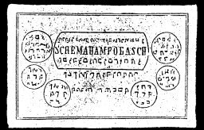

  
[Intangible Textual Heritage](../../index)  [Grimoires](../index) 
[Index](index)  [Previous](m712)  [Next](m714) 

------------------------------------------------------------------------

### THE TWELFTH TABLE OF THE SCHEMHAMFORASCH

(On All Spirits of White and Black Magic)

Conjuration

I, N.N., cite and conjure Thee, Spirit of Schehamforasch, by all the
seventy-two holy names of God, that Thou appear before me and fulfil my
desire, as truly in and through the name Emanuel, which the three youths
Sadrach, Mijsach, and Abednegro sung in the fiery furnace from which
they were released. Fiat, fiat, fiat.

This Twelfth Table when laid upon the Table or Seal of the Spirits will
compel them to appear immediately, and to serve in all things.

------------------------------------------------------------------------

[Next: THE MINISTERING FORMULAS OR MYSTERIES](m714)
