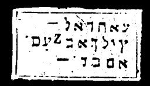

  
[Intangible Textual Heritage](../../index)  [Grimoires](../index) 
[Index](index)  [Previous](m719)  [Next](m721) 

------------------------------------------------------------------------

### MAGICAL LAW OF MOSES

The inscriptions on the seal are to be read as follows:

AILA HIMEL ADONAIJ AMARA ZEBAOTH CADAS YESERAIJE HARALIUS

These words are terrible, and will assemble devils or spirits, or they
will cause the dead to appear.

------------------------------------------------------------------------

[Next: THE INSCRIPTION ON THE CHALICE OF HOLINESS](m721)
