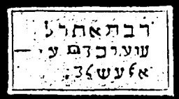

  
[Intangible Textual Heritage](../../index)  [Grimoires](../index) 
[Index](index)  [Previous](m723)  [Next](m725) 

------------------------------------------------------------------------

### CITATION OF GERMUTHSAI OR LEVIATHAN

The inscriptions on the seal are to be read as follows:

LAGUMEN EMANUEL THEREFORI MECHELAG LAIGEL YAZI ZAZAEL

With these names Eleazar bound and unbound the spirits of the air.

------------------------------------------------------------------------

[Next: DISMISSION OF LEVIATHAN](m725)
