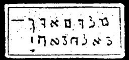

  
[Intangible Textual Heritage](../../index)  [Grimoires](../index) 
[Index](index)  [Previous](m725)  [Next](m727) 

------------------------------------------------------------------------

### BALAAM'S SORCERY

The inscriptions on this seal are to be read as follows:

MELOCH, HEL ALOKIM TIPHRET HOD JESATH

This brings vengeance upon enemies, and must not be disregarded because
it contains the names of the Seven Tables of the Covenant.

------------------------------------------------------------------------

[Next: EGYPT](m727)
