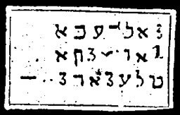

  
[Intangible Textual Heritage](../../index)  [Grimoires](../index.md) 
[Index](index)  [Previous](m726)  [Next](m728.md) 

------------------------------------------------------------------------

### EGYPT

The inscriptions on the seal are to be read as follows:

TANABTIAN AINATEN PAGNIJ AIJOLO ASNIA HICHAIFALE MATAE HABONR HIJCERO

With these words Moses spake to the sorcerers in Egypt. They signify:
"The Lord appeared to his servant in the fire, to seal the earth in its
four quarters, and the nether earth."

------------------------------------------------------------------------

[Next: CONJURATION OF THE LAWS OF MOSES](m728.md)
