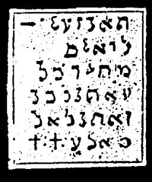

  
[Intangible Textual Heritage](../../index)  [Grimoires](../index) 
[Index](index)  [Previous](m728)  [Next](m730) 

------------------------------------------------------------------------

### GENERAL CITATION OF MOSES ON ALL SPIRITS

The inscriptions on the seal are to be read as follows:

ELION GOEUA ADONAIJ CADAS EBREEL, ELOIL ELA AGIEL, AIJONI SACHADON,
ESSUSELAS ELOHIM, DELIION JAU ELIJULA, DELIA JARI ZAZAEL PALIEMAO UMIEL,
ONALA DILATUM SADATJ, ALMA JOD JAEL THAMA

This citation is great and mighty. They are the names of the Creator,
and the names of the two Cherubim on the Mercy Seat, Zarall and Jael.

------------------------------------------------------------------------

[Next: DISMISSION OF MOSES](m730)
