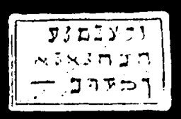

  
[Intangible Textual Heritage](../../index)  [Grimoires](../index.md) 
[Index](index)  [Previous](m729)  [Next](m731.md) 

------------------------------------------------------------------------

### DISMISSION OF MOSES

The inscriptions on this seal are to be read as follows:

WASZEDIM BACHANDA HEZANHAD JEHOV ELOHIM ASSER EHOIE ZALIM

------------------------------------------------------------------------

[Next: GENERAL CITATION OF MOSES ON ALL SPIRITS](m731.md)
