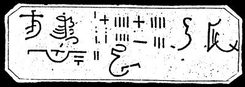

  
[Intangible Textual Heritage](../../index)  [Grimoires](../index) 
[Index](index)  [Previous](m732)  [Next](m734) 

------------------------------------------------------------------------

### CHARACTERS ON THE RIGHT SIDE OF THE ARK OF THE COVENANT OF THE MOST HIGH

Hear, Oh Israel, the Lord our God is God alone.

------------------------------------------------------------------------

[Next: CONJURED SPIRIT APPEARS ON A PILLAR OF FIRE](m734)
