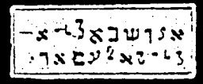

  
[Intangible Textual Heritage](../../index)  [Grimoires](../index.md) 
[Index](index)  [Previous](m736)  [Next](m738.md) 

------------------------------------------------------------------------

### THREE NEW SIGNS WITH FROGS, LICE AND PESTILENCE

The inscriptions on the seal to be read as follows:

ABLAN, AGEISTAN, ZORATAN JURAN, NONDIERAS PORTAEPHIAS POGNIJ AIZAMAI

------------------------------------------------------------------------

[Next: THREE NEW SIGNS WITH CATTLE, PESTILENCE, BLACK SMALLPOX AND
HAIL](m738.md)
