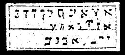

  
[Intangible Textual Heritage](../../index)  [Grimoires](../index.md) 
[Index](index)  [Previous](m741)  [Next](m743.md) 

------------------------------------------------------------------------

### MOSES CHANGES WATER INTO BLOOD

The inscriptions on the seal are to be read as follows:

ABEN AGLA MANDEL SLOP SIEHAS MALIM HAJATH HAJADOSCH IJONEM, CEDAS EBREEL
AMPHIA, DEMISRAEL MUELLE LEAGIJNS AMANIHA

------------------------------------------------------------------------

[Next: EXTRACT FROM THE TRUE CLAVICULA OF SOLOMON AND THE GIRDLE OF
AARON](m743.md)
