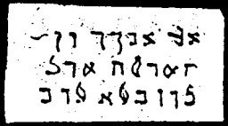

  
[Intangible Textual Heritage](../../index)  [Grimoires](../index.md) 
[Index](index)  [Previous](m751)  [Next](m753.md) 

------------------------------------------------------------------------

### CHAPTER III. MOSES CHANGES WATER INTO BLOOD

Conjuration

AKAUATIU! TUWALU! LABATU!--Arise and change this water into blood.  
Calls with voice and horn as instructed.

------------------------------------------------------------------------

[Next: CHAPTER IV. THREE NEW SIGNS WITH FROGS, MICE, LICE AND SIMILAR
VERMIN](m753.md)
