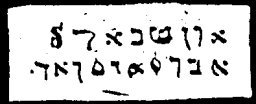

  
[Intangible Textual Heritage](../../index)  [Grimoires](../index.md) 
[Index](index)  [Previous](m752)  [Next](m754.md) 

------------------------------------------------------------------------

### CHAPTER IV. THREE NEW SIGNS WITH FROGS, MICE, LICE AND SIMILAR VERMIN

Conjuration

ADUS! BAACHUR! ARBU! ULU!--Frogs, mice, lice and similar vermin arise in
our service.

------------------------------------------------------------------------

[Next: CHAPTER V. THREE SIGNS OF CATTLE PESTILENCE, BLACK SMALL POX AND
HAIL](m754.md)
