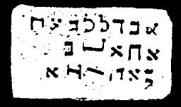

  
[Intangible Textual Heritage](../../index)  [Grimoires](../index) 
[Index](index)  [Previous](m753)  [Next](m755) 

------------------------------------------------------------------------

### CHAPTER V. THREE SIGNS OF CATTLE PESTILENCE, BLACK SMALL POX AND HAIL

Conjuration

ABULL, BAA!--Pestilence, black smallpox and hail, arise in our service.

------------------------------------------------------------------------

[Next: CHAPTER VI. THREE SIGNS WITH GRASSHOPPERS AND DARKNESS](m755)
