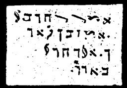

  
[Intangible Textual Heritage](../../index)  [Grimoires](../index.md) 
[Index](index)  [Previous](m754)  [Next](m756.md) 

------------------------------------------------------------------------

### CHAPTER VI. THREE SIGNS WITH GRASSHOPPERS AND DARKNESS

Conjuration

ARDUSI! DALUSI!--Grasshoppers, darkness, arise in our service.

These are the plagues which the Cuthians often employed in their
exorcisms for punishment.

------------------------------------------------------------------------

[Next: CHAPTER VII. GENERAL CITATION OF MOSES ON ALL SPIRITS](m756.md)
