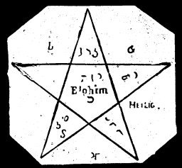

  
[Intangible Textual Heritage](../../index)  [Grimoires](../index) 
[Index](index)  [Previous](m756)  [Next](m758) 

------------------------------------------------------------------------

### THE PENTAGON OR OMNIPOTENT FIVE CORNERS

This mysterious figure must be written before the conjuration, in the
open air and on the ground, with consecrated chalk or with the index
finger of the right hand dipped in holy three-king's water, the same as
it is written on the illustration, but each line must be thirteen feet
in length. The conjuror then kneels in the center of the star, facing
east with head uncovered, and calls out thirteen times, with great faith
and fervor, the names of the three kings, Caspar, Melchior and
Balthasar. He then calls out, with equal sentiment, the most sacred name
of Elohim, 375 times. This conjuration can only take place during the
first three days or nights of the new or full moon, or when Saturn, Mars
and Jupiter are visible in the heavens, as established in the Laws of
Entrance.

------------------------------------------------------------------------

[Next: TREATISE OF THE SEVENTH BOOK OF MOSES](m758)
