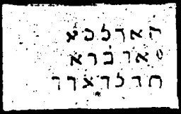

  
[Intangible Textual Heritage](../../index)  [Grimoires](../index) 
[Index](index)  [Previous](m761)  [Next](m763) 

------------------------------------------------------------------------

### CHAPTER IV. EGYPT

Conjuration of Three Angels

GEBRIL! MEACHUEL! NESANEL!--By the lamp of the threefold eternal light,
let N.N. appear before me.

Three calls with the voice and three with the horn.

------------------------------------------------------------------------

[Next: CHAPTER V. CONJURATION OF THE LAWS OF MOSES](m763)
