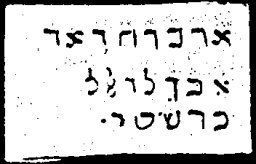

  
[Intangible Textual Heritage](../../index)  [Grimoires](../index) 
[Index](index)  [Previous](m762)  [Next](m764) 

------------------------------------------------------------------------

### CHAPTER V. CONJURATION OF THE LAWS OF MOSES

Conjuration

KEISEHU, NISCHBA, LAWEMSO--How to be God, so swarest Thou to our
parents.

Prayer

Eternal of Eternals! Jehovah of Light, Adonai of Truth! Messiah of the
All Merciful! Jesus Christ the Beloved and All Redemption and Love! Thou
hast said: Who seeth me seeth also the Father. Father, eternal Father of
the old and new convenants. Triune Father, Triune Son, Triune Spirit,
our Father, I beseech and conjure Thee by the eternal words of Thy
eternal truth.

Now read the 17th chapter of John or Jesus' prayer.

Closing Prayer of the Conjuration of the Law

Eternal God Jehovah, Thou hast said: Ask and it shall be given you. I
pray that Thou mayest hear Thy servants Caspar, Melchior and Balthasar,
the archpriest of Thy fountain of light! I pray that I thou mayest bid
thine angels to purify me from all sin; that they may breathe upon me in
love, and that they may cover me with the shadow of their wings. Send
them down! This is my prayer in peace!

------------------------------------------------------------------------

[Next: CHAPTER VI. GENERAL CITATION OF MOSES ON ALL SPIRITS](m764)
