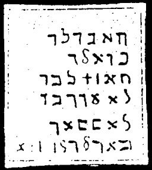
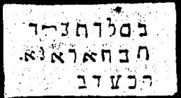

  
[Intangible Textual Heritage](../../index)  [Grimoires](../index.md) 
[Index](index)  [Previous](m764)  [Next](m766.md) 

------------------------------------------------------------------------

### \* CHAPTER VII. GENERAL CITATION OF MOSES ON ALL SPIRITS

Conjuration

TUBATLU! BUALU! TULATU! LABUS! UBLISI!--Let there appear and bring
before me the spirit of N.N.

Each of these five omnipotent angels must be called three times toward
the four quarters of the world, first with the voice then with the horn,
to make a total of six calls.

DISMISSAL OF MOSES

Conjuration

UBELUTUSI! KADUKULITI! KEBUTZI!--Take away from my Presence the spirit
of N.N.

Twelve calls with the voice and twelve calls with the horn for each
name.

------------------------------------------------------------------------

[Next: \* CHAPTER VII. CONJURATION OF ELEAZAR](m766.md)
