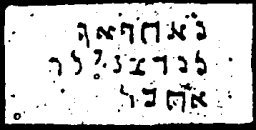

  
[Intangible Textual Heritage](../../index)  [Grimoires](../index.md) 
[Index](index)  [Previous](m767)  [Next](m769.md) 

------------------------------------------------------------------------

### CHAPTER IX. MAGICAL LAWS OF MOSES

Conjuration

KUTA-AL, LEWUWAT--We are great! Our Hearts!

Prayer

Oh Lord, arise, that my enemies may be destroyed and that they may fly;
that those who hate Thee may be scattered like smoke--drive them away.
As wax melteth before the fire, so pass away all evil doers before God,
for God has given thee the kingdom. Pour out Thy wrath over them. Thy
wrath seize them. Thou shalt stand upon leopards and adders, and Thou
shalt subdue the lion and dragon. With God only can we do great things.
He will bring them under our feet.

------------------------------------------------------------------------

[Next: CHAPTER X. HELMET OF MOSES AND AARON](m769.md)
