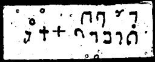

  
[Intangible Textual Heritage](../../index)  [Grimoires](../index) 
[Index](index)  [Previous](m768)  [Next](m770) 

------------------------------------------------------------------------

### CHAPTER X. HELMET OF MOSES AND AARON

WOCHUTU, TUKAL, BESCHUFA, GUTAL--If I shall sin, I shall blow with the
great horn.

Here the horn must be blown three times towards the four quarters of the
earth. For the ram's horn, in the old covenant, is the symbol of
omnipotence and of purification, or of beauty, truth and holiness.

------------------------------------------------------------------------

[Next: CHAPTER XI. BREASTPLATE OF MOSES](m770)
