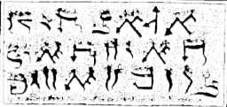

  
[Intangible Textual Heritage](../../index)  [Grimoires](../index.md) 
[Index](index)  [Previous](m775)  [Next](m777.md) 

------------------------------------------------------------------------

### CHAPTER III. MOSES CHANGES WATER INTO BLOOD

------------------------------------------------------------------------

[Next: CHAPTER IV. THREE NEW SIGNS WITH FROGS, LICE AND SIMILAR
VERMIN](m777.md)
