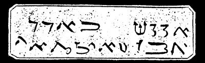

  
[Intangible Textual Heritage](../../index)  [Grimoires](../index) 
[Index](index)  [Previous](m776)  [Next](m778) 

------------------------------------------------------------------------

### CHAPTER IV. THREE NEW SIGNS WITH FROGS, LICE AND SIMILAR VERMIN

------------------------------------------------------------------------

[Next: CHAPTER V. THREE SIGNS OF CATTLE PESTILENCE BLACK SMALLPOX AND
HAIL](m778)
