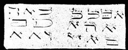

  
[Intangible Textual Heritage](../../index)  [Grimoires](../index) 
[Index](index)  [Previous](m777)  [Next](m779) 

------------------------------------------------------------------------

### CHAPTER V. THREE SIGNS OF CATTLE PESTILENCE BLACK SMALLPOX AND HAIL

------------------------------------------------------------------------

[Next: CHAPTER VI. THREE SIGNS WITH GRASSHOPPERS AND LOCUSTS](m779)
