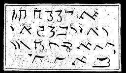

  
[Intangible Textual Heritage](../../index)  [Grimoires](../index.md) 
[Index](index)  [Previous](m778)  [Next](m780.md) 

------------------------------------------------------------------------

### CHAPTER VI. THREE SIGNS WITH GRASSHOPPERS AND LOCUSTS

------------------------------------------------------------------------

[Next: CHAPTER VI. GENERAL CITATION OF MOSES ON ALL SPIRITS](m780.md)
