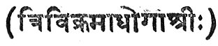
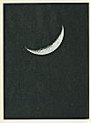
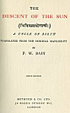
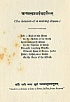
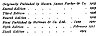

  
[Intangible Textual Heritage](../../../index)  [Hinduism](../../index.md) 
[F.W. Bain](../index)  [Index](index)  [Next](dos01.md) 

------------------------------------------------------------------------

p. v

# THE

# DESCENT OF THE SUN

 

## A CYCLE OF BIRTH

##### TRANSLATED FROM THE ORIGINAL MANUSCRIPT

###### by

### F.W. BAIN

###### SIXTH EDITION

#### METHUEN & Co. LTD.

#### 36 Essex Street W.C.

#### LONDON

#### 1914

###### (Vol II. in Bain's Indian Stories)

#### \[1903\]

NOTICE OF ATTRIBUTION  
Scanned at Intangible Textual Heritage, March 2005. John Bruno Hare,
redactor. This text is in the public domain in the US because it was
published prior to 1922. These files may be used for any non-commercial
purpose, provided this notice of attribution is left intact in all
copies.

[  
Click to enlarge](img/front.jpg.md)  
Frontispiece  

[  
Click to enlarge](img/title.jpg.md)  
Title Page  

p. ii

 

(The illusion of a waking dream.)

<table data-border="0">
<colgroup>
<col style="width: 100%" />
</colgroup>
<tbody>
<tr class="odd">
<td data-valign="top" width="314">
Like a Digit of the Moon 
 In the Shadow of the Earth 
Spirit undergoeth Swoon 
 In the Vestibule of Birth: 
Dreameth transitory Trouble, 
 Weareth Hues of Heaven, hurled 
Hither, thither, as a Bubble 
 On the Ocean of the World.
</td>
</tr>
</tbody>
</table>

 

'*and in a dream I saw a lotus fallen from heaven*'

[  
Click to enlarge](img/p002.jpg.md)  
Page 2  

p. vi

|                                                     |                 |
|-----------------------------------------------------|-----------------|
| *Originally Published by Messrs. James Parker &Co.* | *1903*          |
| *Second Edition*                                    | *1903*          |
| *Third Edition*                                     | *1906*          |
| *Fourth Edition*                                    | *1909*          |
| *First Published by Methuen & Co. Ltd.*             | *June 1910*     |
| *Fifth Edition*                                     | *February 1911* |
| *Sixth Edition*                                     | *1914*          |

[  
Click to enlarge](img/verso.jpg.md)  
Verso  

p. vii

DEDICATED

TO

MARGARET

------------------------------------------------------------------------

[Next: Introduction](dos01.md)
