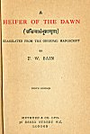

  
[Intangible Textual Heritage](../../../index)  [Hinduism](../../index) 
[F.W. Bain](../index)  [Index](index)  [Next](htd01) 

------------------------------------------------------------------------

p. i

### A HEIFER OF THE DAWN

p. ii

 

'*Lo! how Dark Night shrinks from her sister Dawn, and gloomy Black
gives way to Rosy Red*'--Rig Weda, vii. 71

[  
Click to enlarge](img/front.jpg)  
Frontispiece  

p. iii

# A

# HEIFER OF THE DAWN

 

##### TRANSLATED FROM THE ORIGINAL MANUSCRIPT

###### BY

## F. W. BAIN

###### NINTH EDITION

#### METHUEN & CO. LTD.

#### 36 ESSEX STREET W.C.

#### LONDON

###### 1916

(Volume 3 in Bain's Indian Stories)

#### \[1904\]

NOTICE OF ATTRIBUTION.  
Scanned at Intangible Textual Heritage, March 2005. John Bruno Hare,
redactor. This text is in the public domain in the US because it was
originally published prior to 1922. These files may be used for any
non-commercial purpose, provided this notice of attribution is left
intact in all copies.

[  
Click to enlarge](img/title.jpg)  
Title Page  

[  
Click to enlarge](img/verso.jpg)  
Verso  

p. iv

|                                                      |                 |
|------------------------------------------------------|-----------------|
| *Originally Published by Messrs. James Parker & Co.* | *1904*          |
| *Second Edition*                                     | *1904*          |
| *Third Edition*                                      | *1906*          |
| *Fourth Edition*                                     | *1909*          |
| *First Published by Methuen & Co. Ltd.*              | *June 1910*     |
| *Fifth Edition*                                      | *December 1910* |
| *Sixth Edition*                                      | *June 1911*     |
| *Seventh Edition*                                    | *February 1912* |
| *Eighth Edition*                                     | *March 1914*    |
| *Ninth Edition*                                      | *June 1916*     |

p. v

SODALIBUS NONDUM DEFUNCTIS SALUTEM.

<table data-border="0">
<colgroup>
<col style="width: 100%" />
</colgroup>
<tbody>
<tr class="odd">
<td data-valign="top" width="300">
ANIMULA • VAGULA • BLANDUIA 
HOSPES • COMESQUE • CORPORIS 
FLAMMÂ • PROCUL • SCINTILLULA 
ORCI • TENEBRIS • OBRUTA 
CALIGINOSIS • HEU! VEHOR 
ἔιδωλον • UMBRAE • FABULA 
CEU • NIGRA • CONJUX • INDICA 
FUNCTO • MARITI • CORPORE 
POENAMQUE • NASCI • JUDICO 
NEC • VIVA • JAM • NEC • MORTUA 
QUALISQUE • VESPERTILIO 
DIO • RELAPSO • LUMINE 
NOCTURNA • DEGO • TAEDIA 
DONEC • RESURGET • LUCIFER
</td>
</tr>
</tbody>
</table>

 

------------------------------------------------------------------------

[Next: Preface](htd01)
