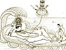

  
[Intangible Textual Heritage](../../../index)  [Hinduism](../../index.md) 
[F.W. Bain](../index)  [Index](index)  [Previous](iggh08.md) 
[Next](iggh10.md) 

------------------------------------------------------------------------

[Buy this Book at
Amazon.com](https://www.amazon.com/exec/obidos/ASIN/1406716642/internetsacredte.md)

------------------------------------------------------------------------

  
*In the Great God's Hair*, by F. W. Bain, \[1905\], at Intangible
Textual Heritage

------------------------------------------------------------------------

### VI. Wild Flowers

Then said Indra: O slender-waisted lady,
thou arguest well of the general duty of wives; and yet this does not
vindicate thy own infatuation in consorting with such a one as is he
whom thou hast

p. 36

chosen for thy husband. Thou hast sacrificed the flower of thy virgin
beauty on an altar unworthy of it, and fallen from the state of a queen
to be the wife of a wandering vagabond.

Then said Wanawallarí: O Brahman, every flower, sooner or later, must
fade, for this is its destined and inevitable end. Fade it must at last,
whether it be on the head of a queen in the palace, or alone in the
depths of the wood. And who shall say, whether it is not better for the
flower to wither in the wood, than as an ornament in the hair of queens?
So then, if I have abandoned my royal position, and betaken myself to
the forest and solitude with my husband, what is lost that deserves to
be regretted? Art thou so sure in my case that it is a loss and not
rather a gain, if like a flower I live and fade in the forest alone? For
once there was a king who was betrayed by his wife. And he cast off his
kingdom like a snake its old skin, and threw away everything like a
blade of grass, and turned his back upon the world. And he went, not to
the Ganges, but away into the great southern forest, for he said: Let me
go where I shall never again see a human face, or hear a human voice
again. So day after day he went on into the unknown depths of that
terrible forest,

p. 37

till after a time he found himself alone with his shadow among the giant
trees. And then, all of a sudden, those trees came abruptly to an end.
And he looked and to I he stood on the bank of a great river, whose
water was studded as far as his eye could see with a countless host of
lotus flowers that coloured that region blue. And every lotus had for
its lover a great golden bee, that buzzed about it like an incarnation
of the sun, come down to earth after self-multiplication, like Krishna
among the *Gopis*, in order that each lotus might think itself alone
beloved. And the king marvelled at the sight of that lonely lotus
haunted, bee-booming river, and he lived there till he died, alone. And
if the Creator could frame those fair flowers in the midst of that
wilderness to live and die with never an eye to see, surely they were
better than if they had all been gathered to fade upon the hair of a
million queens. Moreover, where my husband is, there is no solitude: for
all the company that I need is his.

------------------------------------------------------------------------

[Next: VII. Out of a Former Birth](iggh10.md)
