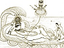

  
[Intangible Textual Heritage](../../../index)  [Hinduism](../../index) 
[F.W. Bain](../index)  [Index](index)  [Previous](iggh12) 
[Next](iggh14) 

------------------------------------------------------------------------

[Buy this Book at
Amazon.com](https://www.amazon.com/exec/obidos/ASIN/1406716642/internetsacredte)

------------------------------------------------------------------------

  
*In the Great God's Hair*, by F. W. Bain, \[1905\], at Intangible
Textual Heritage

------------------------------------------------------------------------

### X. A Pariah Dog

Then said Indra: O lady, whose bow-arched
eyebrow is touched with the exquisite beauty of faint surprise,
certainly that brave Rajpoot deserved his reward: but what is there in
common between his action and that of thyself and thy husband?

p. 47

Then said Wanawallarí: Brahman, that which is common to us is our
reward. For I regard my meeting with my husband as a special favour of
the deity greater even than the rise of Haya in the scale of being, and
due beyond a doubt, like that, to some meritorious action in a previous
birth. But as to our actions in this life, there is still time: and I
will endeavour to efface whatever there may be of egotism and
independence in this action of mine by the whole tenor of my future
obedience. And do not therefore be too apt to estimate the future of our
lives by the past: for while life itself endures, there is the
possibility of change, and many times it has happened that the very
close of life has brought with it something contradictory of its whole
previous course. As once there was a dog without an owner. And it had
nowhere to go, and nothing to eat: but it scraped for itself a miserable
subsistence from the refuse of chance, eating and drinking out of
gutters: and it was very thin, and covered with sores and wounds: for
everyone that saw it cursed it and abused it and drove it about, beating
it with sticks and pelting it with stones; so that living in terror of
perpetual death, it carried its tail between its legs, and in its sad
eyes hunger fought for the

p. 48

mastery with fear and shame. So it continued to live, until at last its
end was near. And one day when it was so weak that it could hardly walk,
there came by it along the road a bullock cart, containing a number of
women who were coming from a wedding feast. And seeing the dog, they all
began to jeer at it. But one of those women got down from the cart, and
going up to the dog with compassion in her heart offered it a piece of
cake. And the dog looked at her with wistful eyes, not understanding;
for in its whole life no one had ever done it a kindness of any sort.
And after a while, it wagged, very gently, the very end of its thin
tail. And thus, O Brahman, none can tell with certainty the end of a
life from its beginning: and it may be that my husband, or even I
myself, may find opportunity to redeem ourselves from thy censure
hereafter, by conduct deserving of thy approval.

------------------------------------------------------------------------

[Next: XI. A Red Lotus](iggh14)
