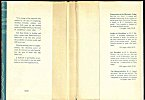
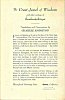

  
[Intangible Textual Heritage](../../index)  [Hinduism](../index.md) 
[Index](index)  [Previous](cjw00)  [Next](cjw02.md) 

------------------------------------------------------------------------

# Cover Material

[  
Click to enlarge](img/jacket.jpg.md)  
Inner Dust Jacket  

*Front*

"The image of the supreme Self, stained by the dust of imaginings,
dwelling inwardly, endless, evil, comes forth pure, by the stirring
power of enlightenment, as the scent of sandalwood comes clear. . . "

And thus clearly, in lucidity and grace, comes forth Śankarâchârya's
instruction to all who have sensed the possibility of a better world,
and will have it so.

With the stirring power of enlightenment, the cleansing power of truth,
he removes the veils from before the eyes of those who will follow him.

A textbook of spirituality is perhaps an impossibility, but this book
makes a very close approach to it.

*Back*

*I have included the dust jacket advertisements along with their 1946
prices, for the sake of completeness.*

**Transactions of the Blavatsky Lodge**. The Key to a Key! A concise and
readable explanation of the *Stanzas of Dzyan* upon which *The Secret
Doctrine* is based, in H.P. Blavatsky's own words! Very valuable to
students of the more profound doctrine.

118 pages, cloth, 2.00

**Studies in Occultism**, by H.P. Blavatsky. A thorough examination of
the meaning of Magic, its relation to the inner constitution of man, and
its place in our modern world. Straight-forward answers to some vital
questions!

212 pages, cloth, 2.25

**Isis Unveiled**, by H.P. Blavatsky. Strange, but every bit true, this
book reveals, in H.P. Blavatsky's own absorbing style, secrets of the
Mysteries of all ages, from remotest antiquity to our own era. A
source-book of Theosophy.

1336 pages, cloth, 7.50

**The Bhagavad-Gitâ**, W.Q. Judge's Recension. The first and the last!
The book of devotion always and ever a companion to the student of
occultism.

133 pages, cloth, 1.25

[  
Click to enlarge](img/bcover.jpg.md)  
Back Cover  

### BACK COVER

The Crest-jewel of Wisdom

and other writings of

Śankarâchârya

Translations and Commentaries by

CHARLES JOHNSTON

FRESH and glowing as it was in the days of the Great Sage,
Śankarâchârya, The *Crest-Jewel* bears the ancient glory that is Wisdom
into our own time. In its precise and beautiful language, and in that of
the other writings of the Sage, which are included in this volume, is
presented his brilliant synthesis of all that is best in the
Upanishads--the *reality* of Spirit.

As it was the work of Gautama the Buddha to "scatter broadcast
throughout the world the teachings of India's Golden Days," so it was
the work of Śankarâchârya to preserve these teachings, to explain them,
and to mark them with a spirit and interest which will not die. It was
by the reforming and refreshing of the Doctrine instituted by
Śankarâchârya at a critical time that the Brâhmans were enabled to carry
forth the sacred flame of knowledge and spirituality through dark and
difficult centuries.

Charles Johnston, the translator of these writings, is well known to
occultists as a profound scholar of Oriental language and philosophy.
The text of this book was published by W. Q. Judge in the Oriental
Department Papers of 1894-6 and in his magazine *The Path*.

<table data-border="0" width="100%">
<colgroup>
<col style="width: 50%" />
<col style="width: 50%" />
</colgroup>
<tbody>
<tr class="odd">
<td data-valign="top" width="50%">
Theosophical University Press
</td>
<td data-valign="top" width="50%">
Covina, California 
(Covina is crossed out) 
P.O. BIN C 
PASADENA 15
</td>
</tr>
</tbody>
</table>

 

 

 

------------------------------------------------------------------------

[Next: Preface](cjw02.md)
