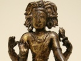

  
[Intangible Textual Heritage](../../index)  [Hinduism](../index) 
[Index](index)  [Previous](dast02)  [Next](dast04) 

------------------------------------------------------------------------

  
*Dakshinamurti Stotra*, translated by Alladi Mahadeva Sastri, \[1920\],
at Intangible Textual Heritage

------------------------------------------------------------------------

p. ix

### CONTENTS

I. SANKARACHARYA'S DAKSHINAMURTI STOTRA AND SURESVARACHARYA'S
MANASOLLASA WITH COMMENTS

INTRODUCTION

Para. 1. Love of God and Guru, the keynote of all revealed religions—2.
Man's highest end—3. Man's evolution as an individual—4. Necessity for
Revelation—5. Devotion to Guru necessary—6–7. Karmakanda and its
lesson–8. Upasana-kanda and its lessons—9. Jnana-kanda—10–11. Devotion
and knowledge—12. Origin and growth of Philosophy—13. Rise of
Materialism—14. Intellectual speculation, orthodox and heterodox—15.
Orthodox methods of intellectual speculation—16. The Tarkika's
tenets—17. The Sankhya Doctrine—18. Buddhistic Doctrine—19. Doctrine of
the Arhats—20. Reaction against pure intellectual speculation—21. Right
method of interpreting the Veda—22. The Mimamsa Doctrine—23. The Vedanta
and its several schools—24–25. The Advaita Doctrine—26. Absolute unity
of the Self and Brahman taught in the Upanishads—27. Distinction between
Jiva and Isvara is due to Maya—28. Jiva is one with I’svara—29. A’tman,
the material cause of the universe—30. A’tman, the one Existence—31.
Maya and Vidya—32. Maya defined—33. Yoga necessary for
self-realisation—34–35. Substantial agreement among philosophers as to
the essential nature of A’tman and the unreality of the universe—36.
Conclusion.

pp. [xix](dast04.htm#page_xix)–lxxv.

p. x

Chapter I.

A’tman as the Ego

First Stanza of the Hymn—The purpose of the Hymn—The fundamental
questions—The Universe exists in the Self The Universe shines by the
light of the Self-Realisation of Non-duality—A’tman as I’svara and
Jiva—I’svara is the Self in all—I’svara's consciousness is one and
self-luminous—I’svara's activity—I’svara and Jiva differentiated by
Upadhi—All differentiation due to Maya. pp. [1](dast05.htm#page_1)–16

Chapter II

A’tman as the First Cause

Second Stanza of the Hymn—Vaiseshika's Atomic theory—Vaiseshika's
threefold cause—The Sankhya Theory—Refutation of the Atomic Theory—The
Theory of Illusion—Intelligence and activity inhere only in the
Sentient—The Vaiseshika's categories—The Sankhya's categories—The
twenty-four Principles of the Theistic Sankhya—The twenty-four
Principles of the Atheistic Sankhya—The Thirty Principles of the
Pauranikas—The thirty-six Principles of S’aivagama—Vedic Doctrine of
Maya—I’svara is not a mere efficient cause. pp.
[17](dast06.htm#page_17)–52

Chapter III

Unity of A’tman

Third Stanza of the Hymn—Absolute unity of A’tman—Avidya, the cause of
delusion—The body separates

p. xi

\[paragraph continues\] Jiva from
I’svara—Their unity taught in the S’ruti "That thou art"—The S’ruti
points to no sort of distinction between Jiva and I’svara—A’tman
identified with the body, etc, by ignorance—A’tman's manifestation in
the five Kosas—Jiva and I’svara one in essence—Realisation of A’tman's
unity leads to Liberation. pp. [53](dast07.htm#page_53)–73

Chapter IV

A’tman the one Existence and Light

Fourth Stanza of the Hymn—Objection to the Vedic doctrine of the one
Existence and Light—External objects have no existence and light of
their own—I’svara cognises and acts through Upadhi—The organ of
cognition—Nadis, the vehicles of the sense-organs—Jagrat
state—Svapna—Sushupti—A’tman is ever Sat-Chit-A’nanda—I’svara, the one
Light and Existence—I’svara as the Ego. pp. [74](dast08.htm#page_74)–95

Chapter V

False Personations of A’tman

Fifth Stanza of the Hymn—A’tman identified with the physical body—A’tman
identified with Prana—A’tman identified with sense-organs—The body,
etc., cannot be A’tman—Why the body is not A’tman—Why the sense-organs
cannot be A’tman—Why Prana is not A’tman—Why Buddhi is not A’tman—Why
the aggregate of the body, etc. is not A’tman—A’tman is
all-pervading—The Illusion. pp. [96](dast09.htm#page_96)–113

p. xii

Chapter VI

A’tman the Eternal Existence

Sixth Stanza of the Hymn Buddhistic—Nihilism (Sunyavada)—Refutation of
Nihilism—Refutation of the doctrine of the five
*Skandhas*—*Pratyabhijna* is no illusion—A’tman's continuous existence,
A’tman's true nature. pp. [114](dast10.htm#page_114)–130

Chapter VII

A’tman the Eternal Light

Seventh Stanza of the Hymn—Authority of Pratyabhijna
questioned—*Pratyabhijnana* explained as a proof of A’tman's
eternality—Adhyasa or Illusion. pp. [131](dast11.htm#page_131)–148

Chapter VIII

Maya

Eighth Stanza of the Hymn—What is Bondage, Liberation and Maya?—All
experience is a fiction—Meaning of "Mithya"—Truth taught through
fiction—Maya nullified by knowledge—Maya defined—Moksha is the
[eradication](errata.htm#1) of Maya. pp. [149](dast12.htm#page_149)–158

Chapter IX

Devotion to I’svara

Ninth Stanza of the Hymn Maya ceases by Devotion—Devotion to Isvara in
His visible forms Unity of Macrocosm and Microcosm—Devotion to I’svara

p. xiii

in the Microcosm leads to unity with the Macrocosm—Correspondences
between Macrocosm and Microcosm, as to Earth, Water, Fire or Light, Air,
A’kasa, the Sun, the Moon and the Soul—Samanaska-Yoga leads to the
Amanaska—The eight steps of Yoga: (1) Yama, (2) Niyama, (3) A’sana, (4)
Pranayama, (5) Pratyahara, (6) Dharana, (7) Dhyana, (8) Samadhi—Yoga,
necessary for steadiness of Manas and Prana—Lambika-Yoga—Signs of
perfection in Yoga I’svara's manifestation in Yoga—Manifestation of
Pranava in Yoga—The Grace of God and Guru necessary. pp.
[159](dast13.htm#page_159)–179

Chapter X

Perfection

Tenth Stanza of the Hymn—The Highest end—The Eight Siddhis—Glory of the
Divine Contemplation—Love of God and Guru necessary for Wisdom. pp.
[180](dast14.htm#page_180)–189

II\. SURESVARCHARYA'S PRANAVA VARTIKA

Purpose of the tract—The Avyakrita—the Sutra or Hiranyagarbha. The three
aspects of manifested Brahman—Visva and his unity with the Viraj—Taijasa
and his unity with the Hiranyagarbha—Prajna and his unity with
I’svara—The One Reality—Contemplation of A’tman by
Pranava—Jivan-mukti—Conclusion. pp. [190](dast15.htm#page_190)–209

III\. DAKSHINAMURTI-UPANISHAD

pp. [210](dast16.htm#page_210)

------------------------------------------------------------------------

[Next: Introduction](dast04)
