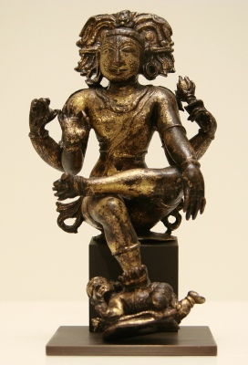

  
[Intangible Textual Heritage](../../index)  [Hinduism](../index) 

------------------------------------------------------------------------

<table width="75%">
<colgroup>
<col style="width: 50%" />
<col style="width: 50%" />
</colgroup>
<tbody>
<tr class="odd">
<td width="50%" data-valign="TOP"></td>
<td width="50%" data-valign="CENTER"><h1 id="dakshinamurti-stotra" data-align="CENTER">Dakshinamurti Stotra</h1>
<h2 id="translated-by-alladi-mahadeva-sastri" data-align="CENTER">translated by Alladi Mahadeva Sastri</h2>
<h4 id="section" data-align="CENTER">[1920]</h4></td>
</tr>
</tbody>
</table>

------------------------------------------------------------------------

[Contents](#contents)    [Start Reading](dast00)    [Page
Index](pageidx)    [Text \[Zipped\]](dast.txt.gz)

------------------------------------------------------------------------

Dakshinamurti is an aspect of the Hindu god Shiva, as a teacher.
Dakshinamurti literally means 'one who is facing south.' An image of
Shiva as Dakshinamurti is part of every temple to Shiva, installed
facing south.

This work primarily contains the Dakshinamurti Stotra, along with
commentary by the translator, as well as two shorter works, the
Pranava-Vartika and the Dakshinamurti-Upanishad. The Dakshinamurti
Stotra is a treatise on Hindu philosophy, attributed to the sage
Sankaracharya, comparing various schools of thought, including Buddhism,
concerning the nature of reality.

------------------------------------------------------------------------

 [Title Page](dast00)  
[Preface to the First Edition](dast01)  
[Preface to the Second Edition](dast02)  
[Contents](dast03)  
[Introduction](dast04)  

### Dakshinamurti Stotra

[Chapter I. Atman as the Ego](dast05)  
[Chapter II. Atman as the First Cause](dast06)  
[Chapter III. Unity of Atman](dast07)  
[Chapter IV. Atman the One Existence and Light](dast08)  
[Chapter V. False Personations of Atman](dast09)  
[Chapter VI. Atman the Eternal Existence](dast10)  
[Chapter VII. Atman, the Eternal Light](dast11)  
[Chapter VIII. Maya](dast12)  
[Chapter IX. Devotion to Isvara](dast13)  
[Chapter X. Perfection](dast14)  

### II. Suresvaracharya's Pranava-Vartika

[Pranava-Vartika](dast15)  

### III. Daksinamurti-Upanishad

[Daksinamurti-Upanishad](dast16)  
