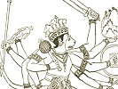

  
[Intangible Textual Heritage](../../index)  [Hinduism](../index.md) 
[Index](index)  [Previous](maha07)  [Next](maha09.md) 

------------------------------------------------------------------------

[Buy this Book at
Amazon.com](https://www.amazon.com/exec/obidos/ASIN/B002B55Q4M/internetsacredte.md)

------------------------------------------------------------------------

  
*The Ramayana and Mahabharata*, by Romesh C. Dutt, \[1899\], at
Intangible Textual Heritage

------------------------------------------------------------------------

# MAHABHARATA BOOK VIII

# BHISHMA-BADHA

(Fall of Bhishma)

All negotiations for a peaceful partition of the Kuru kingdom having
failed, both parties now prepared for a battle, perhaps the most
sanguinary that was fought on the plains of India in the ancient times.
It was a battle of nations, for all warlike races in Northern India took
a share in it.

Duryodhan's army consisted of his own division, as well as the divisions
of ten allied kings. Each allied power is said to have brought one
*akshauhini* troops, and if we reduce this fabulous number to the
moderate figure of ten thousand, including horse and foot, cars and
elephants, Duryodhan's army including his own division was over a
hundred thousand strong.

Yudhishthir had a smaller army, said to have been seven akshauhinis in
number, which we may by a similar reduction reckon to be seventy
thousand. His father-in-law the king of the Panchalas, and Arjun's
relative the king of the Matsyas, were his principal allies. Krishna
joined him as his friend and adviser, and as the charioteer of Arjun,
but the Vrishnis as a nation had joined Duryodhan.

When the two armies were drawn up in array and faced each other, and
Arjun saw his revered elders and dear friends and relations among his
foes, he was unwilling to fight. It was on this occasion that Krishna
explained to him the great principles of Duty in that memorable work
called the *Bhagavat-gita* which has been translated into so many
European languages. Belief in one Supreme Deity is the underlying
thought of this work, and ever and anon, as Professor Garbe remarks,
"does Krishna revert to the doctrine that for every man, no matter to
what caste he may belong, the zealous performance of his duty and the
discharge of his obligations is his most important work."

Duryodhan chose the grand old fighter Bhishma as the commander-in-chief
of his army, and for ten days Bhishma held his own and inflicted serious
loss on Yudhishthir's army. The principal incidents of these ten days,
ending with the fall of Bhishma, are narrated in this Book.

This Book is an abridgment of Book vi. of the original text.

## I

## PANDAVS ROUTED BY BHISHMA

Ushas with her crimson fingers oped the portals of the day,  
Nations armed for mortal combat in the field of battle lay,

Beat of drum and blare of trumpet and the sankha's lofty sound,  
By the answering cloud repeated, shook the hills and tented ground,

And the voice of sounding weapons which the warlike archers drew,  
And the neigh of battle chargers as the arméd horsemen flew,

Mingled with the rolling thunder of each swiftly-speeding car,  
And with pealing bells proclaiming mighty elephants of war!

Bhishma led the Kuru forces, strong as Death's resistless flail,  
Human chiefs nor bright Immortals could against his might prevail,

Helmet-wearing, gallant Arjun came in pride and mighty wrath,  
Held aloft his famed *Gandiva*, strove to cross the chieftain's path!

Abhimanyu son of Arjun, whom the fair Subhadra bore,  
Drove against Kosala's monarch famed in arms and holy lore,

Hurling down Kosala's standard he the dubious combat won,  
Barely escaped with life the monarch from the fiery Arjun's son!

With his fated. foe Duryodhan, Bhima strove in deathful war,  
And against the proud Duhsasan brave Nakula drove his car,

Sahadeva mighty bowman, then the fierce Durmukha sought,  
And the righteous king Yudhishthir with the car-borne Salya fought,

Ancient feud and deathless hatred fired the Brahman warrior bold,  
Drona with the proud Panchalas fought once more his feud of old!

Nations from the Eastern regions 'gainst the bold Virata pressed,  
Kripa met the wild Kaikeyas hailing from the furthest West,

Drupad proud and peerless monarch with his cohorts onward bore  
'Gainst the warlike Jayadratha chief of Sindhu's sounding shore,

Chedis and the valiant Matsyas, nations gathered from afar,  
Bhojas and the fierce Kambojas mingled in the dubious war!

Through the day the battle lasted, and no mortal tongue can tell  
What unnumbered chieftains perished and what countless soldiers fell.

And the son knew not his father, and the sire knew not his son,  
Brother fought against his brother, strange the deeds of valour done!

Horses fell, and shafts of chariots shivered in resistless shock,  
Hurled against the foreman's chariots speeding like the rolling rock,

Elephants by mahuts driven furiously each other tore,  
Trumpeting with trunks uplifted on the serried soldiers bore!

Ceaseless plied the gallant troopers, with a stern unyielding might,  
Pikes and axes, clubs and maces, swords and spears and lances bright,

Horsemen flew as forkéd lightning, heroes fought in shining mail,  
Archers poured their feathered arrows like the bright and glistening
hail!

Bhishma leader of the Kurus, as declined the dreadful day,  
Through the shattered Pandav legions forced his all-resistless way,

Onward went his palm-tree standard through the hostile ranks of war,  
Matsyas, Kasis, nor Panchalas faced the mighty Bhishma's car!

But the fiery son of Arjun, filled with shame and bitter wrath,  
Turned his car and tawny coursers to obstruct the chieftain's path,

Vainly fought the youthful warrior though his darts were pointed well,  
And dissevered from his chariot Bhishma's palm-tree standard fell,

Anger stirred the ancient Bhishma and he rose in all his might,  
Abhimanyu pierced with arrows fell and fainted in the fight!

Then to save the son of Arjun, Matsya's gallant princes came,  
Brave Uttara, noble Sweta, youthful warriors known to fame,

Ah! too early fell the warriors in that sad and fatal strife,  
Matsya's dames and dark-eyed maidens wept the princes' shortened life!

Slain by cruel fate untimely fell two brothers young and good,  
Dauntless still the youngest brother, proud and gallant Sankha stood,

But the helmet-wearing Arjun came to stop the victor's path,  
And to save the fearless Sankha from the ancient Bhishma's wrath,

Drupad too, Panchala's monarch, swiftly rushed into the fray,  
Strove to shield the broken Pandavs and to stop the victor's way.

But as fire consumes the forest, wrathful Bhishma slew the foe,  
None could face his sounding chariot and his ever-circled bow,

And the fainting Pandav warriors marked the foe, resistless, bold,  
Shook like unprotected cattle tethered in the blighting cold!

Onward came the mighty Bhishma and the slaughter fiercer grew  
From his bow like hissing serpents still the glistening arrows flew,

Onward came the ancient warrior and his path was strewn with dead,  
And the broken Pandav forces, crushed and driven, scattered fled,

Friendly night and gathering darkness closed the slaughter of the day,  
To their tents the sons of Pandu held their sad and weary way!

## II

## KURUS ROUTED BY ARJUN

Grieved at heart the good Yudhishthir wept the losses of the day,  
Sought the aid of gallant Krishna for the morning's fresh array,

And when from the eastern mountains SURYA drove his fiery car,  
Bhishma and the helméd Arjun strove to turn the tide of war.

Bhishma's glorious palm-tree standard o'er the field of battle rose,  
Arjun's monkey-standard glittered cleaving through the serried foes,

Devas from their cloud-borne chariots, and *Gandharvas* from the sky,  
Gazed in mute and speechless wonder on the human chiefs from high!

While with dauntless valour Arjun still the mighty Bhishma sought,  
Warlike prince of fair Panchala with the doughty Drona fought,

Ceaseless 'gainst the proud preceptor sent his darts like summer rain,  
Baffled by the skill of Drona, Dhrista-dyumna strove in vain!

But the fiercer darts of Drona pierced the prince's shattered mail,  
Hurtling on his battle chariot like an angry shower of hail,

And they rent in twain his bowstring and they cut his pond'rous mace,  
Slew his steeds and chariot-driver, streaked with blood his godlike
face.

Dauntless still Panchala's hero, springing from his shattered car,  
Like a hungry desert lion with his sabre rushed to war,

Dashed aside the darts of Drona with his broad and ample shield,  
With his sabre brightly flaming fearless trod the reddened field!

In his fury and his rashness he had fallen on that day,  
But the ever-watchful Bhima stopped the proud preceptor's way,

Proud Duryodhan marked with anger Bhima rushing in his car,  
And he sent Kalinga's forces to the thickening ranks of war.

Onward came Kalinga's forces with the dark tornado's might,  
Dusky chiefs, Nishada warriors, gloomy as the sable night,

Rose the shout of warring nations surging to the battle's fore,  
Like the angry voice of tempest and the ocean's troubled roar,

And like darkly rolling breakers ranks of serried warriors flew,  
Scarcely in the thickening darkness friends and kin from foemen knew!

Fell the young prince of Kalinga by the wrathful Bhima slain,  
But against Kalinga's monarch baffled Bhima fought in vain,

Safely sat the eastern monarch on his *howda's* lofty seat,  
Till upon the giant tusker Bhima sprang with agile feet,

Then he struck with fatal fury, brave Kalinga fell in twain,  
Scattered fled his countless forces when they saw their leader slain!

Darkly rolled the tide of battle where Duryodhan's valiant son  
Strove against the son of Arjun famed for deeds of valour done,

Proud Duryodhan marked the contest with a father's anxious heart,  
Came to save his gallant Lakshman from brave Abhimanyu's dart,

And the helmet-wearing Arjun marked his son among his foes,  
Wheeled from far his battle-chariot and in wrath terrific rose!

"Arjun!" "Arjun!" cried the Kurus, and in panic broke and fled,  
Steed and tusker turned from battle, soldiers fell among the dead,

Godlike Krishna drove the coursers of resistless Arjun's car,  
And the sound of Arjun's *sankha* rose above the cry of war,

And the voice of his *Gandiva* spread a terror far and near,  
Crushed and broken, faint and frightened, fled the Kurus in their fear,

Onward still through scattered foemen conquering Arjun held his way,  
Till the evening's gathering darkness closed the action of the day!

## III

## BHISHMA AND ARJUN MEET

Anxious was the proud Duryodhan when the golden morning came,  
For before the car of Arjun fled each Kuru chief of fame,

Brave Duryodhan shook in anger and a tremor moved his frame  
As he spake to ancient Bhishma words of wrath in bitter shame:

"Bhishma! dost thou lead the Kurus in this battle's crimson field,  
Warlike Drona, doth he guard us like a broad and ample shield?

Wherefore then before yon Arjun do the valiant Kurus fly,  
Wherefore doth our leader linger when he hears the battle cry?

Doth a secret love for Pandavs quell our leader's matchless might,  
With a halting zeal for Kurus doth the noble Bhishma fight?

Pardon, chief, if for the Pandavs doth thy partial heart incline,  
Yield thy place, let faithful Karna lead my gallant Kuru line!

Anger flamed on Bhishma's forehead and the tear was in his eye,  
And in accents few and trembling thus the warrior made reply:

"Vain our toil, unwise Duryodhan! Nor can Bhishma warrior old,  
Nor can Drona skilled in weapons, Karna archer proud and bold,

Wash the stain of deeds unholy and of wrongs and outraged laws,  
Conquer with a load of cunning 'gainst a right and righteous cause,

Deaf to wisdom's voice, Duryodhan, deaf to parents and to kin,  
Thou shalt perish in thy folly, in thy unrepented sin!

For the wrongs and insults offered unto good Yudhishthir's wife,  
For the kingdom from him stolen, for the plots against his life,

For the dreadful oath of Bhima, for the holy counsel given,  
Vainly given by saintly Krishna, thou art doomed by righteous Heaven!

Meanwhile since he leads thy forces, Bhishma still shall meet his foe,  
Or to conquer or to perish to the battle's front I go."

Speaking thus, unto the battle ancient Bhishma held his way,  
Sweeping all before his chariot as he swept them day by day,

And the army of Yudhishthir shook from end to farthest end,  
Arjun nor the valiant Krishna could against the tide contend!

Cars were shattered, fled the coursers, elephants were pierced and
slain.  
Shafts of chariots, broken standards, lifeless soldiers strewed the
plain,

Coats of mail were left by warriors as they ran with streaming hair,  
Soldiers fled like herds of cattle stricken by a sudden fear!

Krishna, Arjun's chariot-driver, and a chief of righteous fame,  
Marked the broken Pandav forces, spake in grief and bitter shame:

"Arjun! not in hour of battle hath it been they wont to fly,  
Forward lay thy path of glory, or to conquer or to die!

If to-day with angry Bhishma, Arjun shuns the dubious fight,  
Shame on Krishna! if he joins thee in this sad inglorious flight,

Be it mine alone, O Arjun! warrior's wonted work to know,  
Krishna with his fiery discus smites the all-resistless foe!"

Then he flung the reins to Arjun, left the steeds and sounding car,  
Leaped upon the field of battle, rushed into the dreadful war,

"Shame!" cried Arjun in his anger, "Krishna shall not wage the fight,  
Nor shall Arjun like a recreant seek for safety in his flight!"

And he dashed behind the warrior and on foot the chief pursued,  
Caught him as the angry Krishna still his distant foeman viewed,

Stalwart Arjun lifted Krishna, as the storm lifts up a tree,  
Placed him on his battle-chariot and he bent to him his knee:

"Pardon, Krishna, this compulsion, pardon this transgression bold,  
But while Arjun lives, O chieftain! weapon of thy wrath withhold!

By my warlike Abhimanyu, fair Subhadra's darling boy,  
By my brothers, dearer, truer, than in hours of pride and joy,

By my troth I pledge thee, Krishna,--let thy angry discus sleep,--  
Archer Arjun meets his foeman, and his plighted word will keep."

Forthwith rushed the fiery Arjun in his sounding battle-car,  
And like waves before him parted serried ranks of hostile war,

Vainly hurled his lance Duryodhan 'gainst the valiant warrior's face,  
Vainly Salya, king of Madra, threw with skill his pond'rous mace,

With disdain the godlike Arjun dashed the feeble darts aside,  
Hold aloft his famed *Gandiva* as he stood with haughty pride,

Beat of drum and blare of *sankha* and the thunder of his car,  
And his weapon's fearful accents rose terrific near and far!

Came resistless Pandav forces, sweeping onward wave on wave,  
Chedis, Matsyas, and Panchalas, chieftains true and warriors brave,

Onward too came forth the Kurus by the matchless Bhishma led,  
Shouts arose and cry of anguish midst the dying and the dead,

But the evening closed in darkness and the night-fires fitful flared,  
Fainting troops and bleeding chieftains to their various tents repaired!

## IV

## DURYODHAN'S EIGHT BROTHERS SLAIN

Dawned another day of battle; Kurus knew that day too well,  
Widowed queens of fair Hastina wept before the evening fell,

For as whirlwind of destruction Bhima swept in mighty wrath,  
Broke the serried line of tuskers vainly sent to cross his path,

Smote Duryodhan with his arrows, three terrific darts and five,  
Smote proud Salya; from the battle scarce they bore the chiefs alive!

Then Duryodhan's fourteen brothers rushed into the dreadful fray,  
Fatal was the luckless moment, inauspicious was the day,

Licked his mouth the vengeful Bhima, and he shook his bow and lance,  
As the lion lolls his red tongue when he see his prey advance,

Short and fierce the furious combat; six pale princes turned and fled,  
Eight of proud Duryodhan's brothers f ell and slumbered with the dead!

## V

## SATYAKI'S SONS SLAIN

Morning with her fiery radiance oped the portals of the day,  
Shone once more on Kuru warriors, Pandav chiefs in dread array,

Bhima and the gallant Arjun. led once more the van of war,  
But the proud preceptor Drona faced them in his sounding car!

Still with gallant son of Arjun, Lakshman strove with bow and shield,  
Vainly strove; his faithful henchman bore him bleeding from the field,

Lakshman son of proud Duryodhan, Abhimanyu Arjun's son,  
Doomed to die in youth and glory 'neath the same revolving sun!

Sad the day for Vrishni warriors! Brave Satyaki's sons of might  
'Gainst the cruel Bhuri-sravas strove in unrelenting fight,

Ten brave brothers, pride of Vrishni, fell upon that fatal day,  
Slain by mighty Bhuri-sravas on the battle's red field lay!

## VI

## BHIMA'S DANGER AND RESCUE

Dawned another day of slaughter; heedless Bhima forced his way  
Through Duryodhan's serried legions, where dark death and danger lay,

And a hundred foemen gathered and unequal was the strife,  
Bhima strove with furious valour, for his forfeit was his life!

Fair Panchala's watchful monarch saw the danger from afar,  
Forced his way where bleeding Bhima fought beside his shattered car,

And he helped the fainting warrior, placed him on his chariot-seat,  
But the Kurus darkly gathered, surging round as waters meet!

Arjun's son and twelve brave chieftains dashed into the dubious fray,  
Rescued Bhima and proud Drupad from the Kurus' grim array,

Surging still the Kuru forces onward came with ceaseless might,  
Drona smote the scattered Pandavs till the darksome hours of night!

## VII

## PANDAVS ROUTED BY BHISHMA

Morning came and angry Arjun rushed into the dreadful war,  
Krishna drove his milk-white coursers, onward flew his sounding car,

And before his monkey banner quailed the faint and frightened foes,  
Till like star on billowy ocean Bhishma's palm-tree banner rose!

Vainly then the good Yudhishthir, stalwart Bhima, Arjun brave,  
Strove with useless toil and valour shattered ranks of war to save,

Vainly too the Pandav brothers on the peerless Bhishma fell,  
Gods in sky nor earthly warriors Bhishma's matchless might could quell!

Fell Yudhishthir's lofty standard, shook his chariot battle-tost,  
Fell his proud and fiery coursers, and the dreadful day was lost,

Sahadeva and Nakula vainly strove with all their might,  
Till their broken scattered forces rested in the shades of night!

## VIII

## IRAVAT SLAIN

Morning saw the turn of battle; Bhishma's charioteer was slain,  
And his coursers uncontrolléd flew across the reddened plain,

Ill it fared with Kuru forces when their leader went astray,  
And their foremost chiefs and warriors with the dead and dying lay.

But Gandhara's mounted princes rode across the battle-ground,  
For its steeds and matchless chargers is Gandhara's realm renowned,

And to smite the young Iravat fierce Gandhara's princes swore,  
Brave Iravat son of Arjun, whom a Naga, princess bore!

Mounted on their milk-white chargers proudly did the princes sweep,  
Like the sea-birds skimming gaily o'er the bosom of the deep,

Five of stout Gandhara's princes in that fatal combat fell,  
And a sixth in fear and faintness fled the woeful tale to tell!

Short, alas, Iravat's triumph, transient was the victor's joy,  
Alumbusha dark and dreadful came against the gallant boy,

Fierce and fateful was the combat, mournful is the tale to tell,  
Like a lotus rudely severed gallant son of Arjun fell!

Arjun heard the tale of sorrow and his heart was filled with grief,  
And he spake a father's anguish in his accents few and brief:

"Wherefore, Krishna, for a kingdom mingle in this fatal fray,  
Kinsmen killed and comrades slaughtered,-dear, alas, the price we pay!

Woe unto Hastina's empire built upon our children's grave,  
Dearer than the throne of monarchs was Iravat young and brave,

Young in years and rich in beauty, with thy mother's winsome eye,  
Art thou slain, my gallant warrior, and thy father was not nigh?

But thy young blood calls for vengeance! noble Krishna, drive the car,  
Let them feel the father's prowess, those who slew the son in war!"

And he dashed the rising tear-drop and his words were few and brief,  
Broken ranks and slaughtered chieftains spoke an angry father's grief,

Bhima too revenged Iravat, and as onward still he flew,  
Brothers of the proud Duryodhan in that fatal combat slew,

Still advanced the fatal carnage till the darksome close of day,  
When the wounded and the weary with the dead and lying lay!

## IX

## PANDAVS ROUTED BY BHISHMA

Fell the thickening shades of darkness on the red and ghastly plain,  
Torches by the white tents flickered, red fires showed the countless
slain,

With a bosom sorrow-laden proud Duryodhan drew his breath,  
Wept the issue of the battle and his warlike brother's death.

Spent with grief and silent sorrow slow the Kuru monarch went  
Where arose in dewy starlight Bhishma's proud and snowy tent,

And with tears and soft entreaty thus the sad Duryodhan spoke,  
And his mournful bitter accents oft by heaving sighs were broke:

"Bhishma! on thy matchless prowess Kuru's hopes and fates depend,  
Gods nor men with warlike Bhishma can in field of war contend,

Brave in war are sons of Pandu, but they face not Bhishma's might,  
In their fierce and deathless hatred slay my brothers in the fight!

Mind thy pledge, O chief of Kurus, save Hastina's royal race,  
On the ancient king my father grant thy never-failing grace,

If within thy noble bosom,--pardon cruel words I say,--  
Secret love for sons of Pandu holds a soft and partial sway,

If thy inner heart's affection unto Pandu's sons incline,  
Grant that Karna lead my forces 'gainst the foeman's hostile line!"

Bhishma's heart was full of sadness and his eyelids dropped a tear,  
Soft and mournful were his accents and his vision true and clear:

"Vain, Duryodhan, is this contest, and thy mighty host is vain,  
Why with blood of friendly nations drench this red and reeking plain?

They must win who, strong in virtue, fight for virtue's stainless
laws,  
Doubly armed the stalwart warrior who is armed in righteous cause,

Think, Duryodhan, when *Gandharvas* took thee captive and a slave,  
Did not Arjun rend thy fetters, Arjun righteous chief and brave,

When in Matsya's fields of pasture captured we Virata's kine,  
Did not Arjun in his valour beat thy countless force and mine?

Krishna now hath come to Arjun, Krishna drives his battle-car,  
Gods nor men can face these heroes in the field of righteous war,

Ruin frowns on thee, Duryodhan, and upon thy impious State,  
In thy pride and in thy folly thou hast courted cruel fate,

Bhishma still will do his duty, and his end it is not far,  
Then may other chieftains follow,-fatal is this Kuru war!

Dawned a day of mighty slaughter and of dread and deathful war,  
Ancient Bhishma, in his anger drove once more his sounding car,

Morn to noon and noon to evening none could f ace the victor's wrath,  
Broke and shattered, faint and frightened, Pandavs fled before his path,

Still amidst the dead and dying moved his proud resistless car,  
Till the gathering night and darkness closed the horrors of the war!

## X

## FALL OF BHISHMA

Good Yudhishthir gazed with sorrow on the dark and ghastly plain,  
Shed his tears on chiefs and warriors by the matchless Bhishma slain:

"Vain this unavailing battle, vain this woeful loss of life,  
'Gainst the death-compelling Bhishma hopeless in this arduous strife!

As a lordly tusker tramples on a marsh of feeble reeds,  
As a forest conflagration on the parchéd woodland feeds,

Bhishma tramples on my forces in his mighty battle-car,  
God nor mortal chief can face him in the gory field of war!

Vain our toil and vain the valour of our kinsmen loved and lost,  
Vainly fight my faithful brothers by a luckless fortune crost,

Nations pour their lifeblood vainly, ceaseless wakes the sound of woe,  
Krishna, stop this cruel carnage, unto woods once more we go!"

Sad they held a midnight council and the chiefs in silence met,  
And they went to ancient Bhishma, love and mercy to entreat,

Bhishma loved the sons of Pandu with a father's loving heart,  
But from troth unto Duryodhan righteous Bhishma would not part!

"Sons of Pandu!" said the chieftain, "Prince Duryodhan is my lord,  
Bhishma is no faithless servant nor will break his plighted word,

Valiant are ye, noble princes, but the chief is yet unborn,  
While I lead the course of battle, who the tide of war can turn!

Listen more. With vanquished foeman, or who falls or takes to fight,  
Casts his weapons, craves for mercy, ancient Bhishma doth not fight,

Bhishma doth not fight a rival who submits, fatigued and worn,  
Bhishma doth not fight the wounded, doth not fight a woman born!"

Back unto their tents the Pandavs turn with Krishna deep and wise,  
He unto the anxious Arjun thus in solemn whisper cries:

"Arjun, there is hope of triumph! Hath not truthful Bhishma sworn  
He will fight no wounded warrior, he will fight no woman born?

Female child was brave Sikhandin, Drupad's youngest son of pride,  
Gods have turned him to a warrior, placed. him by Yudhishthir's side,

Place him in the van of battle, mighty Bhishma. leaves the strife,  
Then with ease we fight and conquer, and the forfeit is his life!"

"Shame!" exclaimed the angry Arjun, "not in secret heroes fight,  
Not behind a child or woman screen their valour and their might,

Krishna, loth is archer Arjun to pursue this hateful strife,  
Trick against the sinless Bhishma, fraud upon his spotless life!

Listen, good and noble Krishna; as a child I climbed his knee,  
As a boy I called him father, hung upon him lovingly,

Perish conquest dearly purchased by a mean deceitful strife,  
Perish crown and jewelled sceptre won with Bhishma's saintly life!"

Gravely answered noble Krishna: "Bhishma falls by close of day,  
Victim to the cause of virtue, he himself hath showed the way,

Dear or hated be the foeman, Arjun, thou shalt fight and slay,  
Wherefore else the blood of nations hast thou poured from day to day?"

Morning dawned, and mighty Arjun, Abhimanyu young and bold,  
Drupad monarch of Panchala, and Virata stern and old,

Brave Yudhishthir and his brothers clad in arms and shining mail,  
Rushed to war where Bhishma's standard gleamed slid glittered ill the
gale!

Proud Duryodhan marked. their onset and its fatal purpose knew,  
And his bravest men and chieftains 'gainst the fiery Pandavs threw,

With Kamboja's stalwart monarch and with Drona's mighty soil,  
With the valiant bowman Kripa stemmed the battle still unwon!

And his younger, fierce Duhsasan, thirsting for the deathful war,  
'Gainst the helmet-wearing Arjun drew his mighty battle-car,

As the high and rugged mountain meets the angry ocean's sway,  
Proud Duhsasan warred with Arjun in his wild and onward way,

And as myriad white-winged sea-birds swoop upon the darksome wave,  
Clouds of darts and glistening lances drank the red blood of the brave!

Other warlike Kuru chieftains came, the bravest and the best,  
Drona's self and Bhagadatta monarch of the farthest East,

Car-borne Salya mighty warrior, king of Madra's distant land,  
Princes from Avanti's regions, chiefs from Malwa's rocky strand,

Jayadratha matchless fighter, king of Sindhu's sounding shore,  
Chitrasena and Vikarna, countless chiefs and warriors more!

And they faced the fiery Pandavs peerless in their warlike might,  
Long and dreadful raged the combat, darkly closed the dubious fight,

Dust arose like clouds of summer, glistening darts like lightning
played,  
Darksome grew the sky with arrows, thicker grew the gloomy shade,

Cars went down and mailéd horsemen, soldiers fell in dread array,  
Elephants with white tusks broken and with mangled bodies lay!

Arjun and the stalwart Bhima piercing through their countless foes,  
Side by side impelled their chariots where the palm-tree standard rose,

Where the peerless ancient Bhishma on that dark and fatal day,  
Warring with the banded nations still resistless held his way!

On he came, his palm-tree standard still the front of battle knew,  
And like sun from dark clouds parting Bhishma burst on Arjun's view,

And his eyes brave Arjun shaded at the awe-inspiring sight,  
Half he wished to turn for shelter from that chief of godlike might!

But bold Krishna drove his chariot, whispered low his fatal plan,  
Arjun placed the young Sikhandin in the deathful battle's van,

Bhishma viewed the Pandav forces with a calm unmoving face,  
Saw not Arjun's fair *Gandiva*, saw not Bhima's mighty mace,

Smiled to see the young Sikhandin rushing to the battle's fore,  
Like the foam upon the billow when the mighty storm-winds roar!

Bhishma thought of word he plighted and of oath that he had sworn,  
Dropped his arms before the warrior who a female child was born,

And the standard which no warrior ever saw in base retreat,  
Idly stood upon the chariot, threw its shade on Bhishma's seat,

And the flagstaff fell dissevered on the crushed and broken oar,  
As from azure sky of midnight falls the meteor's flaming star!

Not Sikhandin's feeble arrows did the palm-tree standard fell,  
Not Sikhandin's feeble lances did the peerless Bhishma quell,

T'rue to oath and unresisting, Bhishma turned his face away,  
Turned and fell; the sun declining marked the closing of the day!

Ended thus the fatal battle, truce came with the close of day,  
Kurus and the silent Pandavs went where Bhishma dying lay,

Arjun wept as for a father weeps a sad and sorrowing son,  
Good Yudhishthir cursed the morning Kuru-kshetra's war begun,

Stood Duryodhan and his brothers mantled in the gloom of grief,  
Foes like loving brothers sorrowed round the great the dying chief!

Arjun's keen and pointed arrows made the hero's dying bed,  
And in soft and gentle accents to Duryodhan thus he said:

"List unto my words, Duryodhan, uttered with my latest breath,  
List to Bhishma's dying counsel and revere the voice of death,

End this dread and deathful battle if thy stony heart can grieve,  
Save the chieftains doomed to slaughter, bid the fated nations live.

Grant his kingdom to Yudhishthir righteous man beloved of Heaven  
Keep thy own Hastina's regions, be the hapless past forgiven!

Vain, alas, the voice of Bhishma like the voice of angel spoke,  
Hatred dearer than his lifeblood in the proud Duryodhan woke!

Darker grew the gloomy midnight and the princes went their way,  
On his bed of pointed arrows Bhishma lone and dying lay,

Karna, though he loved not Bhishma whilst the chieftain lived in fame,  
Gently to the dying Bhishma in the midnight darkness came!

Bhishma heard the tread of Karna and he oped his glazing eye,  
Spake in love and spake in sadness and his bosom heaved a sigh:

"Pride and envy, noble Karna, filled our warlike hearts with strife,  
Discord ends with breath departing, envy sinks with fleeting life!

More I have to tell thee, Karna, but my parting breath may fail,  
Feeble are my dying accents and my parchéd lips are pale,

Arjun beats not noble Karna in the deeds of valour done,  
Nor excels in birth and lineage, Karna, thou art Pritha's son!

Pritha bore thee, still unwedded, and the Sun inspired thy birth,  
God-born man! No mightier archer treads this broad and spacious earth,

Pritha cast thee in her sorrow, hid thee with a maiden's shame  
And a driver, not thy father, nursed thee, chief of warlike fame,

Arjun is thy brother, Karna, end this sad fraternal war,  
Seek not lifeblood of thy brother nor against him drive thy car!"

Vain, alas, the voice of Bhishma like the voice of angel spoke,  
Hatred dearer than his life blood in the vengeful Karna woke!

------------------------------------------------------------------------

[Next: Book IX: Fall of Drona](maha09.md)
