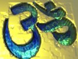

  
[Intangible Textual Heritage](../../index)  [Hinduism](../index) 
[Index](index)  [Previous](ftu02)  [Next](ftu04) 

------------------------------------------------------------------------

  
*From the Upanishads*, by Charles Johnston, \[1899\], at Intangible
Textual Heritage

------------------------------------------------------------------------

p. xv

p. xvi

### TO G. W. RUSSELL

p. xvii

### TO G. W. RUSSELL

 THE brown and yellow of
autumn are touching the chestnut-leaves again for the tenth time since
those early days when we first began to seek the small old path the
seers know.

On such a day as this, rejoicing in the sunlight, we lay on our backs in
the grass, and, looking up into the blue, tried to think ourselves into
that sew world which we had suddenly discovered ourselves to inhabit.
For we had caught the word, handed down with silent laughter through the
ages, that we ourselves are the inventors of the game of life, the kings
of this most excellent universe: that there is so sorrow, but fancy
weaves it; that we need not even knock to be admitted, for we already
are, and always were, though we had forgotten it, within the doors of
life.

That young enthusiasm and hourly icy of living was one of old destiny's
precious presents, a brightness to

p. xviii

remember when storms gathered round us, as they did many a time in the
years wince: there was a gaiety and lightness in the air then, a delight
of new discovery, that I do not think we shall find again; yet I know,
and you also know, what excellent strength we have gained instead. For,
carrying our high hopes with us, all these years, as one side of life
after another was turned to us, as we had to pass through rough ways as
well as smooth, to wrestle with the stubborn tendencies of things,
full-breasted and strenuous, we have fought and worked into ourselves an
intimate knowledge of what we then only divined, we have realized much
that then loomed dim and ghostly before us, we have learned to abide
confidently by spiritual law.

To gain our experience side by side would have been very pleasant, had
fate so willed it; but fate willed quite otherwise. Almost at the
outset.; destiny carried me, vagrant, to the distant rivers of the east,
whose waters mirror old towered shrines among the palm-trees, while the
boatman's song floats echo-like across; or where the breakers of the
lonely,

p. xix

limitless ocean cast forth strange shells upon the sand; or through the
grey alder-forests stretching away desolate to the frozen seas; or
again, among rugged mountains, shaggy with pine-forests, where
rainbow-sparkles carpet the snow.

And you, whom outward fate has held stationary, travelled perhaps
further after all; finding your way homeward to the strange world the
seers tell of, the world at the back of the heavens; and sending to us
your "Songs by the Way."

It was an ambition of mine, in those old days, to translate, from the
Indian books of Wisdom, the story of the Sacrificer's son who was sent
by his father to the house of Death. This story has always seemed to me
a teaching of admirable worth, carrying with it the most precious gift
of all, a sense of the high mysteriousness and vast hidden treasure of
life, which makes us seekers for ever, always finding, yet always
knowing that there is still more to find; so that every day becomes a
thing of limitless promise and wonder, only revealing itself as
containing a new wonder within. For

p. xx

what teaching could bring a more wonderful sense of the largeness and
hidden riches of being than this: that our sincerest friend is the
once-dreaded king of terrors; that death teaches us what no other
can—the lesson of the full and present eternity of life? We need not
wait till our years are closed for his teaching: that wisdom of his,
like every other treasure of life, is all-present in every moment, in
full abundance, here and now. It is the teaching of Death that, to gain
the better, we must lose the dearer; to gain the greater, we must lose
the less; to win the abundant world of reality, we must give up the
world of fancy and folly and fear which we have so long held dear: we
have been learning it all these years since we began; learning also
Death's grim jest, that there is no sacrifice possible for us at all,
for while we were painfully renouncing the dearer, his splendid
generosity had already given us the better—new worlds instead of old.

Well, the ten years are passed, and my ambition is fulfilled; I hand you
my rendering of Death's lesson, and

p. xxi

two more teachings from the same old wise books.

I have found them wise, beyond all others; and, beyond all others,
filled with that very light which makes all things new; the light
discovered first within, in the secret place of the heart, and which
brimming over there fills the whole of life, lightening every dark and
clouded way. That glowing heart within us, we are beginning to guess, is
the heart of all things, the everlasting foundation of the world; and
because speech is given therein to that teaching of oneness, of our
hearts and the heart eternal as eternally one, I have translated the
last of these three passages from the books of Wisdom.

You will find in them, besides high intuition, a quaint and delightful
flavour, a charm of childlike simplicity; yet of a child who is older
than all age, a child of the eternal and infinite, whose simplicity is
better than the wisdom of the wise.

There is no answer in words to the question: What is in the great
Beyond? nor can there be; yet I think we know already that, in the

p. xxii

nameless mystery of the real, it will be altogether well with us—now and
after. This strong reconciliation with the real is, very likely, the
best fruit of our ten years' learning.

CHARLES JOHNSTON.

*Ballykilbeg*,  
 October 15, 1895.

------------------------------------------------------------------------

[Next: I. In the House of Death. The First Part](ftu04)
