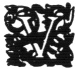

  
[Intangible Textual Heritage](../../index)  [Hinduism](../index) 
[Index](index)  [Previous](ftu03)  [Next](ftu05) 

------------------------------------------------------------------------

  
*From the Upanishads*, by Charles Johnston, \[1899\], at Intangible
Textual Heritage

------------------------------------------------------------------------

p. 1

From the Upanishads

p. 2 p. 3

I

IN THE HOUSE OF DEATH

p. 4 p. 5

### IN THE HOUSE OF DEATH

THE FIRST PART

|                    |
|--------------------|
|  |

VÂJASHRAVASA, verily, seeking favour, made a sacrifice of all he
possessed. He had a son, also, by name Nachiketas. Him, though still a
child, faith entered, while the gifts were being led up.

He meditated:

They have drunk water, eaten grass, given up their milk, and lost their
strength. Joyless worlds, in truth, he gains, who offers these.

He addressed his father:

To whom, then, wilt thou give me? said he.

Twice and thrice he asked him. To Death I give thee, said he.

*Nachiketas ponders:*

I go the first of many; I go in the midst of many. What is Death's work
that he will work on me to-day?

p. 6

Look, as those that have gone before, behold so are those that shall
come after. As corn a mortal ripens, as corn he is born again.

*Nachiketas comes to the House of Death; he speaks:*

Like the Lord of Fire, a pure guest comes to the house. They offer him
this greeting. Bring water, O Death. Son of the Sun!

Hope and expectation, friendship, kind words, just and holy deeds, sons
and cattle, this destroys, for the foolish man in whose house a pure
guest dwells without food.

*After three days Death comes. Death speaks:*

As thou hast dwelt three nights in my bowie, without food, thou, a pure
guest and honourable—honour to thee, pure one, welfare to me—against
this choose thou three wishes

*Nachiketas speaks:*

That the descendant of Gotama may be at peace, well-minded, and with
sorrow gone, towards me, O Death; that he may speak kindly to me when
sent forth by thee; this, of the three, as my first wish I choose.

*'Death speaks:*

p. 7

As before will the son of Aruna, Uddâlaka's son, be kind to thee, sent
forth by me; by night will he sleep well, with sorrow gone, seeing thee
freed from the mouth of Death.

*Nachiketas speaks:*

In the heaven-world there is no fear at all; nor art thou there, nor
does he fear from old age. Crossing over both hunger and thirst, and
going beyond sorrow, he exults in the heaven-world.

The heavenly fire thou knowest, Death, tell it to me, for I am faithful.
The heaven-worlds enjoy deathlessness; this, as my second wish, I
choose.

*Death speaks:*

To thee I tell it; learn then from me, Nachiketas, finding the heavenly
fire. Know thou also the obtaining of unending worlds, the
resting-place, for this is hidden in secret.

He told him then that fire, the beginning of the worlds, and the bricks
of the altar, and how many and how they are. And he again spoke it back
to him as it was told; and Death, well-pleased, again addressed him.

p. 8

This is thy heavenly fire, O Nachiketas, which thou hast chosen as thy
second wish. This fire of thine shall they proclaim. Choose now,
Nachiketas, thy third wish.

*Nachiketas speaks:*

This doubt that there is of a man that has gone forth: "He exists," say
some; and "He exists not," others say: a knowledge of this, taught by
thee, this of my wishes is the third wish.

*Death speaks:*

Even by the gods of old it was doubted about this; not easily knowable,
and subtle is this law. Choose, Nachiketas, another wish; hold me not to
it, but spare me this.

*Nachiketas speaks:*

Even by the gods, thou sayest, it was doubted about this; and not easily
knowable is it, O Death. Another teacher of it cannot be found like
thee. No other wish is equal to this.

*Death speaks:*

Choose sons and grandsons of a hundred years, and much cattle, and
elephants and gold and horses. Choose the great abode of the earth,

p. 9

and for thyself live as many autumns as thou wilt.

If thou thinkest this an equal wish, choose wealth and length of days.
Be thou mighty in the world, O Nachiketas; I make thee an enjoyer of thy
desires.

Whatsoever desires are difficult in the mortal world, ask all desires
according to thy will.

These beauties, with their chariots and lutes—not such as these are to
be won by men—be waited on by them, my gifts. Ask me not of death,
Nachiketas.

*Nachiketas speaks:*

To-morrow these fleeting things wear out the vigour of a mortal's
powers. Even the whole of life is short; thine are chariots and dance
and song.

Not by wealth can a man be satisfied. Shall we choose wealth if we have
seen thee? Shall we desire life while thou art master? But the wish I
choose is truly that.

Coming near to the unfading immortals, a fading mortal here below, and
understanding, thinking on the

p. 10

sweets of beauty and pleasure, who would rejoice in length of days?

This that they doubt about, O Death, what is in the great Beyond, tell
me of that. This wish that draws near to the mystery, Nachiketas chooses
no other wish than that.

*Death speaks:*

The better is one thing, the dearer is another thing; these two bind a
man in opposite ways. Of these two, it is well for him who takes the
better; he fails of his object, who chooses the dearer.

The better and the dearer approach a man; going round them, the sage
discerns between them. The sage chooses the better rather than the
dearer; the fool chooses the dearer, through lust of possession.

Thou indeed, pondering on dear and dearly-loved desires, O Nachiketas,
hast passed them by. Not this way of wealth hast thou chosen, in which
many men sink.

Far apart are these two ways, un-wisdom and what is known as wisdom. I
esteem Nachiketas as one seeking wisdom, nor do manifold desires allure
thee.

p. 11

Others, turning about in unwisdom, half-wise and thinking they are
learned, fools, stagger, lagging in the way, like the blind led by the
blind.

The great Beyond gleams not for the child, led away by the delusion of
possessions. "This is the world, there is no other," he thinks, and so
falls again and again under my dominion.

That is not to be gained even for a hearing by many, and hearing it many
understand it not. Wonderful is the seeker of it, blessed the receiver;
wonderful is the knower of it, taught by the blessed.

Not by the lower man is this, when declared, to be known even by much
meditation. There is no way to it unless told by the other, very subtle
it, nor can it be debated by formal logic.

The understanding of this cannot be gained by debate; but it is declared
by the other, dearest, for a right understanding. Thou hast obtained it,
for thou art steadfast in the truth; may a questioner like thee,
Nachiketas, come us.

"I know that what they call treasure

p. 12

is unenduring; and by unlasting things what is lasting cannot be
obtained. Therefore the Nachiketas fire was kindled by me, and for these
unenduring things I have gained that which endures."

Thus saying, and having beheld the obtaining of longings, the
resting-place of the world, the endlessness of desire, the shore where
there is no fear, greatly praised, and the wide-sung resting-place,
thou, Nachiketas, wise in thy firmness, hast passed them by.

But that which is hard to see, which has entered the secret place, and
is hidden in secret, the mystery, the ancient; understanding that bright
one by the path of union with the inner self, the wise man leaves
exultation and sorrow behind.

A mortal, hearing this and understanding it, drawing forth that subtle
righteous one from all things else, and obtaining it, rejoices, having
gained good cause for rejoicing; and the door to it is wide open, I
think, Nachiketas.

*Nachiketas speaks:*

What thou seest to be neither the law nor lawlessness, neither what

p. 13

commanded nor what is forbidden; neither what has been nor what shall
be, tell me that.

*Death speaks:*

That resting-place which all the Vedas proclaim, and all austerities
declare; seeking for which they enter the service of the Eternal, that
resting-place I briefly tell to thee.

It is the unchanging Eternal, it is the unchanging supreme; having
understood that unchanging one, whatsoever a man wishes, that he gains.
It is the excellent foundation, the supreme foundation; knowing that
foundation, a man is mighty in he eternal world.

The knower is never born nor dies, nor is it from anywhere, nor did it
become anything. Unborn, eternal, immemorial, this ancient is not slain
when the body is slain.

If the slayer thinks to slay it, if the sin thinks it is slain, neither
of them understand; this slays not nor is slain.

Smaller than small, greater than great, this Self is hidden in the heart
of man. He who has ceased from desire, and passed sorrow by, through

p. 14

the favour of that ordainer beholds the greatness of the Self.

Though seated, it travels far; though at rest, it goes everywhere; who
but me is worthy to know this bright one who is joy without rejoicing?

Understanding this great lord the Self, bodiless in bodies, stable among
unstable, the wise man cannot grieve. This Self is not to be gained by
speaking of it, nor by ingenuity, nor by much hearing. Whom this
chooses, by him it is gained, and the Self chooses his form as its own.

He who has ceased not from evil, who is not at peace, who stands not
firm whose emotions are not at rest, cannot obtain it by knowledge.

Priest and Warrior are its food, its anointing is death; who knows truly
where it is?

*Death speaks:*

The knowers of the Eternal, those of the five fires, and of the triple
fire of Nachiketas, tell of the shadow and the fire—*the soul and the
spirit*—entering into the cave and drinking their reward in the World of
good works, on the higher path.

p. 15

This is the bridge of the sacrificers, the undying Eternal, the supreme,
the fearless, the harbour of those who would cross over—may we master
the fire of Nachiketas.

Know that the Self is the lord of the chariot, the body verily is the
chariot; know that the soul is the charioteer, and emotion the reins.

They say that the bodily powers are the horses, and that the external
world is their field. When the Self, the bodily powers and emotion are
joined together, this is the right enjoyer; thus say the wise.

But for the unwise, with emotion ever unrestrained, his bodily powers
run away with him, like the unruly horses of the charioteer.

For him who is wise, with emotion ever restrained, his bodily powers do
not run away with him, like the well-ruled horses of the charioteer.

But he who is unwise, restrains not emotion, and is ever impure, gains
not that resting-place, but returns to the world of birth and death.

He who is wise, restrains emotion, and is ever pure, gains that
resting-dace from which he is not born again.

p. 16

He whose charioteer is wisdom, who grasps the reins—emotion—firmly, he
indeed gains the end of the path, the supreme resting-place of the
emanating Power.

The impulses are higher than the bodily powers; emotion is higher than
the impulses; soul is higher than emotion; higher than soul is the Self,
the great one.

Higher than this great one is the unmanifest; higher than the unmanifest
is spirit. Than spirit nothing is higher, for it is the goal, and the
supreme way.

This is the hidden Self; in all beings it shines not forth; but is
perceived by the piercing subtle soul of the subtle-sighted.

Let the wise hold formative voice and emotion; let him hold them in the
Self which is wisdom; let him hold this wisdom in the Self which is
great; and this let him hold in the Self which is peace.

Rise up! awake! and, having obtained your wishes, understand them.

The sages say this path is hard, difficult to tread as the keen edge of
a razor.

p. 17

He is released from the mouth of Death, having gained the lasting thing
which is above the great, which has neither sound nor touch nor form nor
change nor taste nor smell, but is eternal, beginningless, endless.

This is the immemorial teaching of Nachiketas, declared by Death.
Speaking it and hearing it the sage is mighty in the eternal world.
Whosoever, being pure, shall cause this supreme secret to be heard, in
the assembly of those who seek the Eternal, or at the time of the union
with those who have gone forth, he indeed builds for endlessness, he
builds for endlessness.

------------------------------------------------------------------------

[Next: In the House of Death, Second Part](ftu05)
