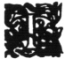

  
[Intangible Textual Heritage](../../index)  [Hinduism](../index.md) 
[Index](index)  [Previous](ftu04)  [Next](ftu06.md) 

------------------------------------------------------------------------

  
*From the Upanishads*, by Charles Johnston, \[1899\], at Intangible
Textual Heritage

------------------------------------------------------------------------

p. 18

### IN THE HOUSE OF DEATH

#### THE SECOND PART

|                    |
|--------------------|
|  |

THE Self-Being pierced the openings outward; hence one looks outward,
not within himself. A wise man looked towards the Self with reverted
sight, seeking deathlessness.

Children seek after outward desires; they come to the net of widespread
death. But the wise, beholding deathlessness, seek not for the enduring
among unenduring things.

By that which perceives form, taste, smell, sounds, and embraces; by
this verily he discerns, for what else is there? This is that.

The wise man, thinking that that by which he perceives both waking and
dreaming life, is the great, the. lord, the Self, grieves not.

He who perceives the living Self, the honey-eater, close at hand, the
lord of what has been and what shall be, he is no longer seeking for
refuge. This is that.

p. 19

He who knows the first-born of radiance, born of old of the waters,
standing hid in secret, who looked forth through creatures. This is
that.

And the great mother, full of divinity, who comes forth through life,
standing hid in secret, who was born through creatures. This is that.

The fire hidden in the fire-sticks—like a germ, well concealed by the
mothers—that fire is day by day to be praised by men who wake, with the
oblation. This is that.

Whence the sun rises, and whither he goes to setting; that all the
bright ones rest on, nor does any go beyond it. This is that.

What is here, that is there; what is there, that also is here. He goes
from death to death who sees a difference between them.

This is to be received by the mind, that there is no difference here.
From death to death he goes, who sees a difference.

The spirit of the measure of a finger stands in the midst, in the Self;
lord of what has been, and what shall be. Thereafter one is no longer
seeking for refuge. This is that.

p. 20

The spirit of the measure of a finger is like a light without smoke;
lord of what has been and what shall be, the same to-day and to-morrow.
This is that.

As water rained on broken ground runs away among the mountains; so he
who beholds separate natures runs hither and thither after them.

As pure water poured in pure remains the same, so is the Self of the
discerning sage, O descendant of Gotama.

Understanding the eleven-doored dwelling of the unborn seer of truth, he
grieves not; and, freed, he is set free. This is that.

This is the Swan in the pure world, the radiant in the middle world, the
fire here on the altar; as a guest in a dwelling.

This is the essence of man, the essence of the best, the essence of the
deep and the ether; those born of the water, of earth, of the deep, of
the mountains, are that true great one.

He leads upward the forward-life, and casts back the downward-life. All
the bright powers bow to the dwarf seated in their midst.

p. 21

When this lord of the body, standing within the body, departs; when he
goes forth free from the body, what is left? This is that.

No mortal lives by the forward-life, nor by the downward-life. But by
another they live, in whom these two rest.

This secret immemorial Eternal, I shall declare to thee; and how the
Self is, on attaining death, O descendant of Gotama.

Some come to the womb, for the embodying of that lord of the body.
Others reach the resting-place, according to deeds, according to what
they have understood.

The spirit that wakes in those that dream, moulding desire after desire,
is that bright one, that Eternal; that they call the immortal one. In
this all the worlds rest, nor does any go beyond it. This is that.

As fire, being one, on entering the world, is assimilated to form after
form; so the inner Self of all being is assimilated to form after form,
and yet remains outside them.

As the air, being one, on entering the world, is assimilated to form
after

p. 22

form; so the inner Self of all being is assimilated to form after form,
and yet remains outside them.

As the sun, the eye of all the world, is not smeared by visible outer
stains; so the inner Self of all being is not smirched by sorrow of the
world, but remains outside it.

The one ruler, the inner Self of all being, who makes one form manifold;
the wise who behold him within themselves, theirs is happiness, and not
others'.

The durable among undurables; the soul of souls, who though one,
disposes the desires of many; the wise who behold him within themselves,
theirs is peace everlasting, and not others'.

This is that, they think, the ineffable supreme joy. How then may I
know, whether this shines or borrows its light? No sun shines there, nor
the moon and stars; nor lightnings, nor fire like this. All verily
shines after that shining. From the shining of that, all this borrows
light.

 

Rooted above, with branches below,

p. 23

is this immemorial Tree. It is that bright one, that Eternal; it is
called the immortal. In it all the worlds rest; nor does any go beyond
it. This is that.

All that the universe is, moves in life, emanated from it. It is the
great fear, the upraised thunderbolt. They who have seen it, become
immortal.

Through fear of this, Fire glows; through fear of this, the Sun glows;
through fear of it, the King and Breath; and Death runs, as fifth.

If one has been able to understand it here, before the body's falling
away, he builds for embodiment in the creative worlds.

As in a mirror, this is seen in the Self; as in a dream, it is seen in
the world; as in 'the waters around, it is seen in the world of sylphs;
as in the fire and the shadow, it is seen in the world of the Evolver.

Considering the life of the powers as apart, and their rising and
setting as they grow up apart, the wise man grieves not.

Mind is higher than the powers, the real is higher than mind; than this
real, the great Self is higher;

p. 24

and than the great, the unmanifest is higher.

Than the unmanifest, spirit is higher, the universal and formless;
knowing which a being is released, and goes to immortality.

The form of this does not stand visible, nor does anyone behold it with
the eye., By the heart, the soul, the mind, it is grasped; and those who
know it become immortal.

When the five perceptions and mind are steadied; and when the soul
struggles not, this, they say, is the highest way.

This they think to be anion, the firm holding of the powers. Unperturbed
is this union, though there be ebb and flow.

Nor by speech, nor by mind can it be gained; nor by sight. It is gained
by him who can affirm "It is"; how else could it be gained?

It is to be gained by affirming "It is"; and as the real in what is and
is not. In him who obtains it by affirming "It is" its reality is
perfected.

When all desires that dwell in his heart are let go, the mortal becomes
immortal, and reaches the Eternal.

p. 25

When all the knots of his heart are untied here, the mortal becomes
immortal. So far is the teaching.

A hundred and one are the heart's channels; of these one passes to the
crown. Going up by this, he comes to the immortal. The others lead
hither and thither. .

The spirit of the measure of a finger, the inner Self, ever dwells in
the hearts of men. Let him draw forth this spirit from his body, firmly,
like the pith from a reed.

Let him know that this is the bright one, the immortal. Let him know it
is the bright one, the immortal.

Nachiketas thus having received the knowledge declared by Death, and the
whole law of union, became a passionless dweller in the Eternal, and
deathless; and so may another who thus knows the union with the Self.

------------------------------------------------------------------------

[Next: II. A Vedic Master](ftu06.md)
