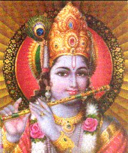

  
[Intangible Textual Heritage](../../index)  [Hinduism](../index) 

------------------------------------------------------------------------

[Gita Society Translation](agsgita)    [SBE vol. 8
Translation](../sbe08/index)    [Sanskrit](../bgs/index)

------------------------------------------------------------------------

<table width="75%">
<colgroup>
<col style="width: 50%" />
<col style="width: 50%" />
</colgroup>
<tbody>
<tr class="odd">
<td data-valign="CENTER" width="50%"> 
</td>
<td data-valign="CENTER" width="50%"><h1 id="the-bhagavad-gita" data-align="CENTER">The Bhagavad Gita</h1>
<h2 id="translated-by-edwin-arnold" data-align="CENTER">Translated by Edwin Arnold</h2>
<h3 id="section" data-align="CENTER">[1885]</h3></td>
</tr>
</tbody>
</table>

------------------------------------------------------------------------

The Bhagavad Gita is technically part of [Book 6 of the
Mahabharata](../m06/index), although it is known to be a later accretion
to the saga, which stands on its own merits. It is a dialog between the
God Krishna and the hero Arjuna, taking place in a timeless moment on
the battlefield before the climactic struggle between good and evil. The
Gita (which can be found in hotel bedstands throughout India) is a
classic summary of the core beliefs of Hinduism. It has had a
significant influence far beyond Hinduism. Robert Oppenheimer
apocryphically recited the verse (from [Chapter 11](bg11)) 'I \[have
become\] Death, Destroyer of Worlds", just before the first test of the
atom bomb, which ironically has a much different meaning in context.

This has now been cross-referenced with the [Sanskrit
text](../bgs/index).

------------------------------------------------------------------------

[Chapter 1: Of the Distress of Arjuna](bg01)  
[Chapter 2: Of Doctrines](bg02)  
[Chapter 3: Virtue in Work.](bg03)  
[Chapter 4: Of the Religion of Knowledge](bg04)  
[Chapter 5: Of Religion by Renouncing Fruit of Works](bg05)  
[Chapter 6: Of Religion of Self-Restraint](bg06)  
[Chapter 7: Of Religion by Discernment](bg07)  
[Chapter 8: Of Religion by Devotion to the One Supreme God](bg08)  
[Chapter 9: Of Religion by the Kingly Knowledge and the Kingly
Mystery](bg09)  
[Chapter 10: Of Religion by the Heavenly Perfections](bg10)  
[Chapter 11: Of the Manifesting of the One and Manifold](bg11)  
[Chapter 12: Of the Religion of Faith](bg12)  
[Chapter 13: Of Religion by Separation of Matter and Spirit](bg13)  
[Chapter 14: Of Religion by Separation from the Qualities](bg14)  
[Chapter 15: Of Religion by Attaining the Supreme](bg15)  
[Chapter 16: Of the Separateness of the Divine and the Undivine](bg16)  
[Chapter 17: Of Religion by the Threefold Kinds of Faith](bg17)  
[Chapter 18: Of Religion by Deliverance and Renunciation](bg18)  
