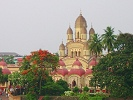

  
[Intangible Textual Heritage](../../index)  [Hinduism](../index.md) 
[Index](index)  [Previous](gork01)  [Next](gork03.md) 

------------------------------------------------------------------------

[Buy this Book on
Kindle](https://www.amazon.com/exec/obidos/ASIN/B002I62OVC/internetsacredte.md)

------------------------------------------------------------------------

  
*The Gospel of Ramakrishna*, ed. by Swami Abhedananda, \[1907\], at
Intangible Textual Heritage

------------------------------------------------------------------------

p. xi

### CONTENTS

|        |                                                                    |                                 |
|--------|--------------------------------------------------------------------|---------------------------------|
|        |                                                                    | PAGE |
|        | Introduction.                                                      | [1](gork03.htm#page_1.md)          |
| I.     | Srî Râmakrishna at the Temple of Dakshineswara                     | [21](gork04.htm#page_21.md)        |
| II\.   | Srî Râmakrishna with His Disciples at the Temple                   | [36](gork05.htm#page_36.md)        |
| III\.  | The Bhagavân with Certain of His Householder Disciples             | [62](gork06.htm#page_62.md)        |
| IV\.   | Visit to the Pandit Vidyâsâgara                                    | [99](gork07.htm#page_99.md)        |
| V.     | Day on the River with Keshab Chunder Sen                           | [142](gork08.htm#page_142.md)      |
| VI\.   | Sunday at the Temple                                               | [179](gork09.htm#page_179.md)      |
| VII\.  | Some Incidents in the Life of Srî Râmakrishna (as told by Himself) | [207](gork10.htm#page_207.md)      |
| VIII\. | Feast at the Garden-house of Surendra                              | [225](gork11.htm#page_225.md)      |
| IX\.   | Visit to a Hindu Pandit and Preacher                               | [261](gork12.htm#page_261.md)      |
| X.     | Gathering of Disciples at the Temple.                              | [289](gork13.htm#page_289.md)      |
| XI\.   | Srî Râmakrishna at the Sinti Brâhmo-Samâj                          | [319](gork14.htm#page_319.md)      |
| XII\.  | At the House of Balarâm, a Disciple                                | [347](gork15.htm#page_347.md)      |
| XIII\. | A Day at Shâmpukur                                                 | [379](gork16.htm#page_379.md)      |
| XIV\.  | Cossipur Garden-house                                              | [411](gork17.htm#page_411.md)      |

------------------------------------------------------------------------

[Next: Introduction](gork03.md)
