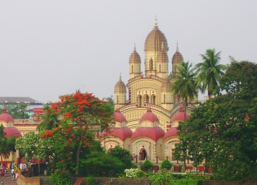

  
[Intangible Textual Heritage](../../index)  [Hinduism](../index.md) 

------------------------------------------------------------------------

[Buy this Book on
Kindle](https://www.amazon.com/exec/obidos/ASIN/B002I62OVC/internetsacredte.md)

------------------------------------------------------------------------

<table width="75%">
<colgroup>
<col style="width: 50%" />
<col style="width: 50%" />
</colgroup>
<tbody>
<tr class="odd">
<td width="50%" data-valign="TOP"> 
Kali temple where Ramakrishna spent a major portion of his adult life, near Dakshineswar (photo--Wikimedia)</td>
<td width="50%" data-valign="CENTER"><h1 id="the-gospel-of-ramakrishna" data-align="CENTER">The Gospel of Ramakrishna</h1>
<h2 id="ed.-by-swami-abhedananda" data-align="CENTER">ed. by Swami Abhedananda</h2>
<h4 id="section" data-align="CENTER">[1907]</h4></td>
</tr>
</tbody>
</table>

------------------------------------------------------------------------

[Contents](#contents)    [Start Reading](gork00.md)    [Page
Index](pageidx)    [Text \[Zipped\]](gork.txt.gz.md)

|                                                                                                                           |
|---------------------------------------------------------------------------------------------------------------------------|
|  |

------------------------------------------------------------------------

God is Infinite. Infinite are the Forms in which He manifests Himself.
Infinite also are the ways leading to Him.--p. 312

Sri Ramakrishna, (1836-1886) was a Bengali mystic who had a huge impact
on the development of modern Hinduism. His chief disciple, Swami
Vivekananda, not only helped revive Hinduism in India, but also
introduced Hinduism to the West. Ramakrishna was a non-dualist
worshippper of the Goddess Kali. However, he also experimented with
Christianity and Islam, and repeatedly preached the diversity of paths
to God.

This is the story of Ramakrishna told first-hand as a series of days and
nights spent with his disciples and lay followers. Imagine someone
following Buddha or Jesus around with a steno pad and then publishing
candid transcripts of their notes. This is the Victorian-era equivalent.
We watch Ramakrishna go into his trances, sing devotional songs, and
dispense parables. We get to listen into his profound discourses,
including lucid descriptions of very high-level yogic techniques. This
is a unique look at a holy man.--J.B. Hare

Production notes: this is a completely new scan of different, and
earlier translation of this work than the edition previously seen
elsewhere on the web, translated by Swami Nikhilananda. The author
listed as "M" was apparently Mahendra Nath Gupta (1855-1932), who
transcribed the notes into a five volume Bengali edition, and later
translated them into English. The English translations of the Gospel of
Ramakrishna, this one included, are derived from his work.

Also at this site: Max Müller's [Ramakrishna, His Life and
Sayings](../rls/index.md).

------------------------------------------------------------------------

 [Title Page](gork00.md)  
[Preface](gork01.md)  
[Contents](gork02.md)  
[Introduction](gork03.md)  
[Chapter I. Srî Râmakrishna at the Temple of Dakshineswara](gork04.md)  
[Chapter II. Srî Râmakrishna With his Disciples at the Temple](gork05.md)  
[Chapter III. The Bhagavân With Certain of His Householder
Disciples](gork06.md)  
[Chapter IV. Visit to the Pandit Vidyâsâgara](gork07.md)  
[Chapter V. Day On the River With Keshab Chunder Sen](gork08.md)  
[Chapter VI. Sunday at the Temple](gork09.md)  
[Chapter VII. Some Incidents in the Life of Srî Râmakrishna (as Told by
Himself)](gork10.md)  
[Chapter VIII. Feast at the Garden-House of Surendra](gork11.md)  
[Chapter IX. Visit to a Hindu Pandit and Preacher](gork12.md)  
[Chapter X. Gathering of Disciples at the Temple](gork13.md)  
[Chapter XI. Srî Râmakrishna at the Sinti Brâhmo-Samâj](gork14.md)  
[Chapter XII. At the House of Balarâm, a Disciple](gork15.md)  
[Chapter XIII. A Day at Shâmpukur](gork16.md)  
[Chapter XIV. Cossipur Garden-House](gork17.md)  
[Index](gork18.md)  
