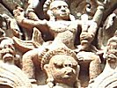

  
[Intangible Textual Heritage](../../index)  [Hinduism](../index) 
[Index](index)  [Previous](gpu09)  [Next](gpu11) 

------------------------------------------------------------------------

[Buy this Book on
Kindle](https://www.amazon.com/exec/obidos/ASIN/B002L16PNW/internetsacredte)

------------------------------------------------------------------------

  
*The Garuda Purana*, by Ernest Wood and S.V. Subrahmanyam, \[1911\], at
Intangible Textual Heritage

------------------------------------------------------------------------

p. 61

### CHAPTER VIII.

#### An Account of the Gifts for the Dying.

1\. Garuḍa said: Tell me, O Lord, all the rites for those in the other
worlds who have done good, and also how these rites should be performed
by the sons.

2\. The Blessed Lord said: O Tārkṣya, you have done well in questioning
me for the benefit of mankind. I will tell you all about the rites
proper for the righteous.

3-4. The good person, finding his body, in its old age, afflicted with
diseases, and the planetary conditions unfavourable, and not hearing the
sounds of life,

And knowing his death to be near, should he fearless and alert, and
should make reparation for any sins committed knowingly or in ignorance.

5-8. When it is near the time to die he must perform his ablutions, and
worship Viṣṇu in the form of Śālagrāma.

p. 62

He must worship with fragrant substances, with flowers, with red
saffron, with leaves of the holy basil, with incense, with lamps, with
offerings of food and many sweetmeats, and other things.

He should give presents to Brāhmiṇs, should feed them with the
offerings, and should recite the eight and the twelve syllabled mantras.

He should call to mind, and listen to, the names of Viṣṇu and Śiva. The
name of Hari, coming with the range of hearing, takes away the sins of
men.

9\. Relatives, coming near the diseased, should not mourn. My holy name
should be remembered and meditated upon repeatedly.

10-11. The Fish, the Tortoise, the Boar, the Man-lion, the Dwarf,
Paraśurāma, Rāma, Kṛiṣṇa, Buddha, and also Kalkī [1](#fn_66):

These ten names should always be meditated upon by the wise. Those who
recite them near the diseased are called relatives.

12-16. Of him who gives voice to the auspicious name "Kṛiṣṇa" tens of
millions of great sins are quickly reduced to ashes.

Even the dying Ajāmila reached heaven by pronouncing the name Hari,
which had been given to his son.  [2](#fn_67)
How much more then is its effect when it is pronounced with faith!

p. 63

Hari, meditated upon even by one who has evil thoughts, takes away sins:
fire burns, even though accidentally touched.

The sinful man is not able to sin while the power of the name Hari is
uprooting the sins, O Twice-born.

Yama said to his servants: "Bring the man who denies, but O messengers,
do not bring the man who meditates on the name Hari."

17-20. One should worship the Achyuta, Keśava, Nārāyaṇa, Kṛiṣṇa,
Dāmodara, Vāsudeva, Hari, Śrīdhara, Mādhavam, Gopīkāvallabham,
Rāmachandra, the Lord of Jānakī. [1](#fn_68)

"O servants, do not go near those sinless people who take refuge in the
lotus-eyed Vāsudeva and Viṣṇu, who is the supporter of the earth, and
carries in his hand the conch and discus.

"Bring those sinners who always turn away from time nectar of the
lotus-feet of Viṣṇu,--which are served by the race of Paramahaṅsas, who
know the true essence of things, and are without possessions,--and those
whose desires are bound up in the household, which is the path to hell."

"Bring them whose tongues do not pronounce the qualities and name of the
Lord, whose minds do not meditate upon His lotus feet, whose heads never
bow to Kṛiṣṇa, who do not offer worship to Viṣṇu."

21-23. Know, then, O Lord of Birds, the hymning of Viṣṇu, which bestows
welfare on the universe, to be the best expiation for even great sins.

p. 64

The performance of penances does not purify the wicked man, who has
turned his face away from Nārāyaṇa; just as even rivers cannot purify a
liquor-pot.

By the name of Kṛiṣṇa one is riddened of sins, and never sees, even in
dream, Yama nor his servants.

24-25. The man, having a body of flesh, bones and blood,--who, towards
the end gives cows to the twice-born, uttering "Nandanandanam," never
falls into the Vaitaraṇī.

Hence one should remember the name of Mahā Viṣṇu, which effaces
multitudes of sins, and should read or listen to the Gītā and the Hymn
of the Thousand Names.

26-27. The fast of the eleventh day, the Gītā, the water of the Ganges,
the leaves of the holy basil, the foot-water and names of Viṣṇu--all
these are givers of freedom at the time of death.

Then he must dedicate food, with clarified butter and gold, to a learned
twice-born and. also give cows with calves.

28-31. Whatever a man gives in his last days, little or much, if it is
approved by his Son, is exempt from decay, O Tārkṣya.

In these last days a good son should make all the gifts. It is for the
sake of this that the wise pray for a righteous son in this world,

p. 65

The sons, seeing their father lying upon the ground with eyes
half-closed, should not covet his earned wealth. [1](#fn_69)

A good son will make such gifts as will prolong his father's life, and
free him from misery when he goes into the next world.

32-34. In disease and calamity two gifts rank above all others. They are
indispensable--the eight-fold gift of sesamum and other things.

Sesamum, iron, gold, cotton stuff, salt, the seven grains, a plot of
ground, a cow,--every one of these is said to purify.

The eight great gifts are the effacers of great sins, and should be
given in the last days. Hear now their good effects:

35-36. There are three kinds of holy sesamums generated from my sweat.
Asuras, Dānavas and Daityas [2](#fn_70) are
gratified by the gift of these sesamums.

White, black and brown are the three kinds of sesamums. The gift of
these removes the sins gathered in speech, thought and action.

37-40. A gift of iron-ore should be made with the hands touching the
ground,--then he does not go within the domain of Yama, nor tread his
path.

p. 66

Yama holds in his hands, for the punishing of the sinful, an axe, a
threshing-pestle, a rod, a sword and a dagger.

This gift is considered propitiatory to these weapons of Yama. Therefore
should be made the gift of iron, which is the bringer of happiness in
the world of Yama.

Because of this gift of iron, happiness is bestowed by these great
messengers of Yama:--Uraṇa, Śyāmasūtra, Śuṇdāmarka, Udumbara, Śeṣa and
Bala.

41-44. Hear this great secret, O Tārkshya, about this most supreme gift,
by which are pleased the dwellers in Bhū, Bhūvar and Swar worlds. [1](#fn_71)

Brahmā and others, sages, shining ones, and those who are in the
assembly of the King of Justice are gratified by the gift of gold, and
become granters of boons.

Therefore a gift of gold should be made for the uplifting of the
departed. He does not go to the world of Yama, O child, but reaches
heaven.

He dwells for a long time in the world of truth and is then reborn here
as a king, handsome, righteous, eloquent, prosperous, and of unexcelled
strength.

45\. By the gift of cotton-stuff one is freed from fear of the
messengers. By the gift of salt one is freed from the fear of Yama.

p. 67

46-48. By gifts of inn, salt, cotton-stuff, sesamum and gold,
Chitragupta and the others who dwell in the city of Yama are
propitiated.

And by gifts of the seven grains the standard-bearer of the King of
Justice and others who stand at the gates are propitiated.

Rices, barley, wheat, kidney beans, māṣa, [1](#fn_72) panic seeds; dwarf-peas: these are called
the seven grains.

49-52. It has been observed by the sages that the gift of a plot of land
of the size of a cow's hide, in accordance with the rites, to a proper
person, absolves one from Brahmicide.

Not by vows, not by holy pilgrimages, not by any gifts but by the gift
of land is a great sin committed in kingship expiated.

He who gives to the twice-born land filled with grains goes to the abode
of Indra and is worshipped by divinities and demons.

All other gifts, O Kāśyapa, are producers of little fruit. The fruit
produced by the gift of land increases daily.

53-55. He who, having become a king, does not give land to the
twice-born, is reborn for many times as a beggar, without even a village
hut.

The king who, through pride, does not make gifts of land, shall dwell in
hell as long as Śeṣa [2](#fn_73) supports the
earth.

Therefore shall a king especially make gifts of land; though for others,
I say, the gift, of a cow is equal to a gift of land.

p. 68

56-57. Towards the end, a cow should be given. He should give a cow to
overcome death, another to absolve himself of debts, another for the
gaining of liberation.

With special rites, O Bird, should the gift of a cow for Vaitaraṇī be
made. The cows verily carry the man beyond three kinds of hells.

58-61. The sins committed in boyhood, in youth, in manhood, in old age
and in previous births;

The sins committed in the night, in the morning, in the forenoon and the
afternoon, in the twilight;--of action, speech and thought,

Having given even once a tawny cow, milkgiving, with the calf and other
necessary things, to a well-conducted and austere Brāhmiṇ, learned in
the Vedas,--one is absolved of all these sins. The giver is released by
her at the end from the accumulated sins.

62-63. The gift of one cow while one is in full vigour of mind, the gift
of a hundred cows while suffering from diseases, the gift of a thousand
when dying and bereft of mental faculties,

And the gift of one hundred thousand cows after death [1](#fn_74), are equal. A gift made to a deserving
person, who has bathed at the sacred waters, increases a hundred
thousand fold.

p. 69

64\. A gift made to a deserving person multiplies a
hundred-thousand-fold. It brings unending fruit to the giver and does
not harm the recipient.

65-68. One who has studied the scriptures and made fire-offerings to the
shining ones and who does not eat food cooked by others is not polluted
by receiving even the earth filled with precious stones.

Mantras and fire, the removers of cold and poison, do not themselves
partake of these evil qualities. The cow given to an undeserving person
leads the giver to hell,

And it troubles the recipient's people for a hundred generations. A gift
should not be made to an undeserving person by the wise who desire their
own welfare.

One cow should be given to one only, and never to many. If he either
sells it or shares it his family will he troubled to the seventh
generation.

69\. I will tell you about the gilt of a cow, which is a means for
crossing the Vaitaraṇī River, of which I have spoken to you already.

p. 70

70-76. One should decorate a black or reddish cow, tip its horns with
gold, silver its feet, and milk it into a bronze vessel;

Cover it with a pair of black cloths, hang a bell round its neck, and
place the covered bronze vessel upon some cotton-stuff,

Put there a golden image of Yama, and an iron rod; place clarified
butter in the bronze vessel and put all upon the cow;

Make a raft of sugarcanes, fastening it with silk threads; make a hole,
fill it with water, and in it place the raft:

Having placed the things which are born from the body of the sun in it,
dedicate the cow there in accordance with the scriptures. [1](#fn_75)

Present the cloths, with ornaments to a Brāhmiṇ; properly worship with
fragrances, flowers, and coloured rice [2](#fn_76),

Take hold of the tail of the cow, place a foot in the boat, and, having
honoured a Brāhmiṇ, recite this mantra:--

77-82. "O Lord of the Universe, compassionate to those who seek refuge
in Thee, Thou art verily the saviour of those who are immersed in the
ocean of existence, made miserable by the waves of sorrow and remorse.

p. 71

"O Best of the Twice-born, the very form of Viṣṇu, God upon earth,
uplift me. I have presented this gift to you. Salutations to Vaitaraṇī!

"I have presented this to you, being desirous of crossing that river,
which is a hundred yojanas in extent, and lies on the very dreadful way
of Yama. Salutations to Vaitaraṇī.

"O Cow, look upon me, for the sake of my passing through the gateway of
Yama on the great path. Salutations to thee, Vaitaraṇī, Queen of the
shining ones!

"May cows be in front of me; may cows be behind me; may cows be in my
heart [1](#fn_77); and may I dwell in the midst
of cows.

"May she who is the Goddess of Prosperity for all creatures, who is the
mainstay of the shining ones, its the form of a cow remove my sins."

83-84. With hands together having invoiced, with these mantras, Yama in
the form of a cow, and having walked round all these things, he should
give them to the Brāhmiṇ.

He who, with these rites, gives the Vaitaraṇī cow, goes by a righteous
path into the assembly of the King of Justice.

85-86. Whether the body is well or ill one should carry out the
Vaitaraṇī observance. The wise man, desiring to cross that river, should
make a gift of a cow.

That river, O Bird, does not appear in the Great Way after the gift of a
cow. [2](#fn_78) Therefore it is necessary to
give a cow at all sacred times.

p. 72

87-88. At all the sacred bathing-places, like the Ganges, and in the
dwelling-places of Brāhmiṇs; at the eclipses of the sun and moon, at the
crossing over [1](#fn_79), on the day of the new
moon.

At the equinoctial and solstitial points, at Vyatīpāta, [2](#fn_80) on Yuga days [3](#fn_81) and at other sacred times,--the supreme
gift of a cow should be made.

89\. That verily is called the sacred time, in which faith is produced,
and when a proper person is present,--thence flows unending benefit.

90\. Bodies are transitory; possessions are not eternal; death is always
near;--one should accumulate righteousness.

91-92. So one who desires his own welfare should make unending gifts,
according to his wealth, to a learned Brāhmiṇ.

The gift of even a little wealth, presented with one's own hand:--this
is unending, and the time is effectual.

93-94. He who has gifts as provision, goes happily on the Great Way.
Otherwise--without provision--the man suffers pain on the path.

All the gifts made by human beings in this world clear the way for them
on the path of the world of Yama.

p. 73

95-96. By the power of great merit, birth as a human being is obtained.
He who, having gained it, follows righteousness, reaches the supreme
goal.

The man who neglects righteousness, goes and comes in misery. The
fruitfulness of birth as a human being depends upon the pursuit of
righteousness alone.

97-99. Wealth, sons, wife and fancily, body, kinsmen,--all these are
transitory. Therefore righteousness should be sought.

So long as a man is alive he has a father and other relatives; but when
they have known him to be dead, their affection soon fades away.

He should constantly remember that the true kinsman of the self is the
Self. If not to the living, much less will anyone give to the dead.

100\. Knowing all this, one should give with one's own hand, while still
alive. Life is transient; and who can give afterwards?

101-102. The relatives turn away with averted faces leaving the dead
body on the ground, like a lump of wood or earth, but righteousness goes
with him.

The wealth disappears from the house, and the relatives from the
cremation-ground. The good and evil karma he has made goes with him.

103-104. When his body has been destroyed by fire his karma remains and
wherever he is the man experiences it, be it good or bad.

p. 74

Nobody has a relation in this changing ocean of sorrow. He is born by
the attraction of karma, and goes again upon its exhaustion.

105-106. Like creatures in a water-tank, and like the motion or sticks
in a river is one's contact with mother, father, son, brother, kinsman,
wife and the others.

Whose are the sons, and the grandsons? Whose is the wife, or the wealth?
In the world of change nobody belongs to anybody. Therefore one should
make gifts himself.

107-100. As long as one is in possession of wealth, so long should one
make gifts to a Brāhmiṇ; but when the wealth becomes another's one can
have nothing to say.

On account of gifts made in a former birth much wealth is obtained in
this. Hence should wealth be given, by one knowing this, for the sake of
righteousness.

Wealth is born of righteousness; by righteousness desire is conquered.
Righteousness verily is the cause of freedom. Therefore should
righteousness be pursued.

110-111. Righteousness is supported by faith, not by large piles of
wealth. The wise, though in poverty, leave faith, and go to heaven. From
him who offers to Me, with devotion, a leaf, a flower, a fruit or
water--from him, the self-subdued, I accept that, presented with
devotion.

p. 75

112\. Therefore, by all means, a gift should be made, and as prescribed.
Whether it be small or great does not count with me.

113-114. A righteous son is honoured even by the shining ones. He should
cause his ailing father to make gifts on earth.

If the wealth made by the father is given to the deserving by the
sons--then, by that, himself, his sets, grandsons and great-grandsons
are ennobled.

115\. What is given through the father has a hundred-fold merit; through
the mother, a thousand-fold; through the sister, ten-thousand fold;
through the brother, incalculable.

116-118. For him who makes gifts there are no troubles and no torments
of hell, and no fear caused by the messengers of Yama at the time of
death.

All those sinful-misers, O Bird, who, because of greed, do not make
gifts at the time of illness come to grief when dead.

Sons, grandsons, brothers, kinsmen and friends who do not make gifts on
behalf of a dying man are without doubt slayers of Brāhmaṇ.

------------------------------------------------------------------------

### Footnotes

[62:1](gpu10.htm#fr_68) The ten avatāras,
descents or incarnations of Viṣṇu, which appeared in archaic and ancient
times, except Kalkī, who is still to come.

[62:2](gpu10.htm#fr_69) Ajāmila was a man of
very evil life, who named his son Nārāyaṇa, and happened to call him as
he was dying.

[63:1](gpu10.htm#fr_70) Names of Vishnu.

[65:1](gpu10.htm#fr_71) They may expect
ancestral property, but not that earned by the father.

[65:2](gpu10.htm#fr_72) Classes of non-human
beings.

[66:1](gpu10.htm#fr_73) Physical, astral and
lower mental worlds.

[67:1](gpu10.htm#fr_74) A kind of spotted grain.

[67:2](gpu10.htm#fr_75) The eternal serpent.

[68:1](gpu10.htm#fr_76) That is, given by
another for one.

[70:1](gpu10.htm#fr_77) Probably the
afore-mentioned cow, ghee, gold, silk, etc. are closely connected with
sacrifice and therefore with the sun.

[70:2](gpu10.htm#fr_78) Akṣata, whole rice
coloured with turmeric and saffron, and used to honour persons by
sprinkling over them.

[71:1](gpu10.htm#fr_79) Note here, that the cow
is merely a symbol.

[71:2](gpu10.htm#fr_80) Note the subjective
character of the "river."

[72:1](gpu10.htm#fr_81) The passing of the sun
from one constellation to another.

[72:2](gpu10.htm#fr_82) When the sun and moon
are on opposite sides of either solstice, and the minutes declination
are the same.

[72:3](gpu10.htm#fr_83) Every month there is a
day called Yuga--the last or last but one.

------------------------------------------------------------------------

[Next: Chapter IX. An Account of the Rites for the Dying](gpu11)

